# THIẾT KẾ MICRO-SERVICE CHO CAB SYSTEM

# 1. PHÂN TÁCH USE CASE THEO MIỀN NGHIỆP VỤ

Dựa trên các Use Case UC01–UC09, các API và Entity hiện có, CAB SYSTEM được phân thành 7 Bounded Context.

| Bounded Context               | Use Case/chức năng liên quan                            | Năng lực nghiệp vụ                                               | Khái niệm chính                               |
| ----------------------------- | ------------------------------------------------------- | ---------------------------------------------------------------- | --------------------------------------------- |
| **Identity & User**           | Đăng ký, đăng nhập, hồ sơ User, phần tài khoản của UC08 | Quản lý tài khoản, xác thực, hồ sơ và Role                       | User, Role, UserStatus, Authentication        |
| **Driver Management**         | Cập nhật Driver, Vehicle, Availability; hỗ trợ UC02     | Quản lý tài xế, xe, trạng thái sẵn sàng và vị trí                | Driver, Vehicle, AvailabilityStatus, Location |
| **Ride Management**           | UC01, UC03, UC04, UC06                                  | Tính giá, tạo Ride, theo dõi, cập nhật trạng thái, hoàn tất, hủy | Ride, Location, RideStatus, Fare              |
| **Dispatch & Driver Request** | UC02                                                    | Tìm Driver và xử lý việc nhận/từ chối/hết hạn yêu cầu            | DriverRequest, SearchRadius, RequestTimeout   |
| **Payment**                   | UC05                                                    | Thanh toán CASH/ONLINE và xử lý callback                         | Payment, PaymentMethod, PaymentStatus         |
| **Rating**                    | UC07                                                    | Customer đánh giá Driver sau Ride                                | Rating, Score, Comment                        |
| **Operations**                | UC09, theo dõi Ride đang hoạt động                      | Theo dõi vận hành và ghi nhận Incident                           | Incident, RideSummary                         |

UC08 là Use Case xuyên nhiều Context. Việc quản lý Account thuộc Identity, Driver/Vehicle thuộc Driver Management; repository không có API cấu hình riêng nên không tạo một Configuration Service mới.

---

# 2. UBIQUITOUS LANGUAGE

| Thuật ngữ               | Ý nghĩa trong CAB SYSTEM                                 | Context                   |
| ----------------------- | -------------------------------------------------------- | ------------------------- |
| **User**                | Tài khoản người dùng chung của hệ thống                  | Identity & User           |
| **Customer**            | User có Role `CUSTOMER`, tạo và sử dụng Ride             | Identity & User           |
| **Driver**              | Hồ sơ tài xế gắn với User Role `DRIVER`                  | Driver Management         |
| **Vehicle**             | Phương tiện Driver sử dụng                               | Driver Management         |
| **Availability Status** | Trạng thái `AVAILABLE`, `OFFLINE` hoặc `BUSY` của Driver | Driver Management         |
| **Ride**                | Yêu cầu/chuyến đi do Customer tạo                        | Ride Management           |
| **Pickup**              | Điểm đón của Ride                                        | Ride Management           |
| **Destination**         | Điểm đến của Ride                                        | Ride Management           |
| **Estimated Fare**      | Giá dự kiến trước khi Ride được thực hiện                | Ride Management           |
| **Final Fare**          | Giá cuối sau khi Ride hoàn thành                         | Ride Management           |
| **Ride Status**         | Trạng thái vòng đời Ride                                 | Ride Management           |
| **Driver Request**      | Một lần gửi yêu cầu Ride đến một Driver                  | Dispatch & Driver Request |
| **Search Radius**       | Bán kính tìm Driver, hiện tại là 5 km                    | Dispatch & Driver Request |
| **Request Timeout**     | Thời gian chờ phản hồi Driver, hiện tại là 30 giây       | Dispatch & Driver Request |
| **Payment**             | Giao dịch thanh toán gắn với một Ride                    | Payment                   |
| **Cash Payment**        | Thanh toán tiền mặt                                      | Payment                   |
| **Online Payment**      | Thanh toán thông qua Payment Gateway                     | Payment                   |
| **Rating**              | Đánh giá Customer dành cho Driver                        | Rating                    |
| **Score**               | Điểm đánh giá từ 1 đến 5                                 | Rating                    |
| **Incident**            | Sự cố Ride do Operations staff ghi nhận                  | Operations                |
| **Operations Staff**    | Người theo dõi Ride và xử lý sự cố                       | Operations                |

Luồng thuật ngữ nghiệp vụ chính:

```text
Customer
   ↓
Ride
   ↓
DriverRequest
   ↓
Driver ACCEPTED
   ↓
Ride được thực hiện
   ↓
Ride COMPLETED
   ├── Payment
   └── Rating
```

---

# 3. BOUNDED CONTEXT VÀ CONTEXT MAP

## 3.1. Context Map

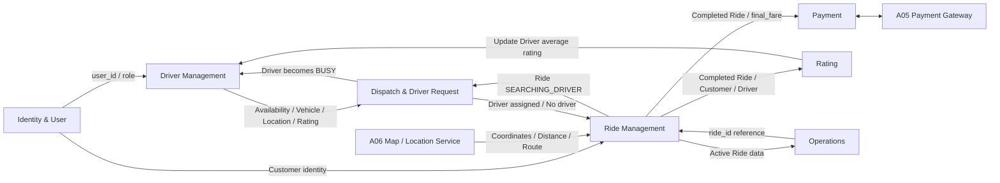

---

## 3.2. Core Business Flow

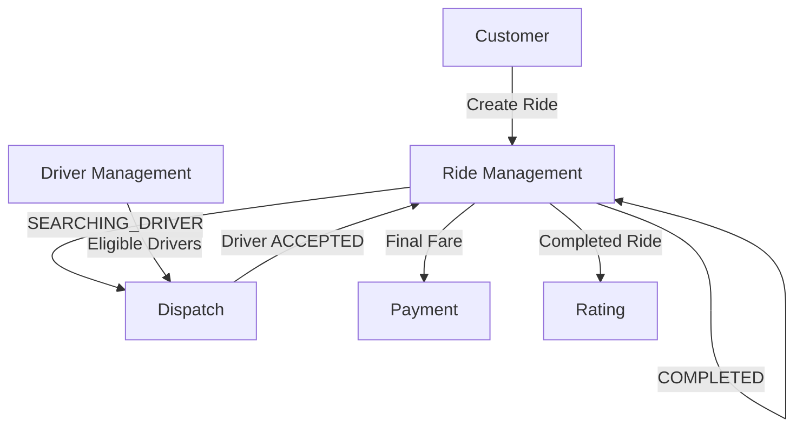

---

## 3.3. Quan hệ Context

| Upstream          | Downstream        | Nội dung trao đổi                                   |
| ----------------- | ----------------- | --------------------------------------------------- |
| Identity & User   | Driver Management | `user_id`, Role                                     |
| Identity & User   | Ride Management   | Customer identity                                   |
| Driver Management | Dispatch          | Driver, VehicleType, Availability, Location, Rating |
| Ride Management   | Dispatch          | Ride, Pickup, VehicleType, preference               |
| Dispatch          | Ride Management   | Driver được chọn hoặc `NO_DRIVER`                   |
| Dispatch          | Driver Management | Driver chuyển `BUSY` khi nhận chuyến                |
| Ride Management   | Payment           | Ride status, `final_fare`                           |
| Ride Management   | Rating            | Ride status, Customer, Driver                       |
| Rating            | Driver Management | Rating mới để cập nhật điểm trung bình              |
| Ride Management   | Operations        | Ride đang hoạt động                                 |
| Payment Gateway   | Payment           | Kết quả ONLINE transaction                          |

---

# 4. AGGREGATE VÀ INVARIANT NGHIỆP VỤ

## 4.1. Bảng Aggregate

| Aggregate               | Aggregate Root  | Thành phần                                     | Invariant chính                                                   | Use Case                 |
| ----------------------- | --------------- | ---------------------------------------------- | ----------------------------------------------------------------- | ------------------------ |
| User Aggregate          | `User`          | Identity, Role, Status, Credential             | Phone duy nhất; Role tự đăng ký chỉ CUSTOMER/DRIVER               | Đăng ký, đăng nhập, UC08 |
| Driver Aggregate        | `Driver`        | Vehicle, Availability, Location, Rating        | AVAILABLE; đúng VehicleType; không đồng thời 2 Ride               | UC02                     |
| Ride Aggregate          | `Ride`          | Pickup, Destination, VehicleType, Fare, Status | Ride state phải chuyển hợp lệ; Customer chỉ có một Ride hoạt động | UC01, UC03, UC04, UC06   |
| DriverRequest Aggregate | `DriverRequest` | RideRef, DriverRef, Status, Expiration         | 30s timeout; Driver hợp lệ; chỉ một Driver thắng                  | UC02                     |
| Payment Aggregate       | `Payment`       | Method, Status, Amount, ProviderTransaction    | Ride phải COMPLETED; tối đa một Payment hợp lệ                    | UC05                     |
| Rating Aggregate        | `Rating`        | Score, Comment, RideRef, DriverRef             | Ride COMPLETED; score 1–5; tối đa một Rating                      | UC07                     |
| Incident Aggregate      | `Incident`      | RideRef, Type, Priority, Status                | Chỉ Operations/Admin có quyền ghi nhận                            | UC09                     |

---

## 4.2. User Aggregate

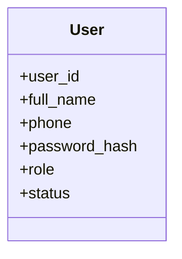

### Invariant

```text
phone phải duy nhất

password đăng ký >= 8 ký tự

role tự đăng ký:
CUSTOMER hoặc DRIVER

OPERATIONS / ADMIN
không được tự đăng ký qua /auth/register
```

---

## 4.3. Driver Aggregate

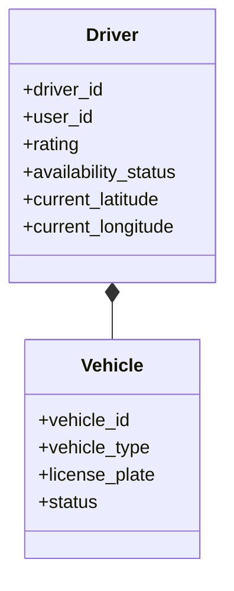

Invariant:

```text
availability_status = AVAILABLE
            +
vehicle_type đúng với Ride
            +
Driver trong bán kính 5 km
            ↓
Driver đủ điều kiện nhận DriverRequest
```

Driver đang có Ride hoạt động không được nhận thêm Ride.

---

## 4.4. Ride Aggregate

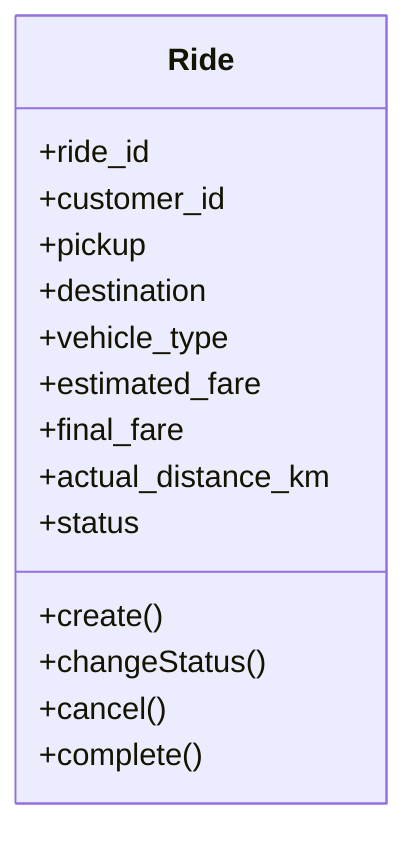

### State Machine

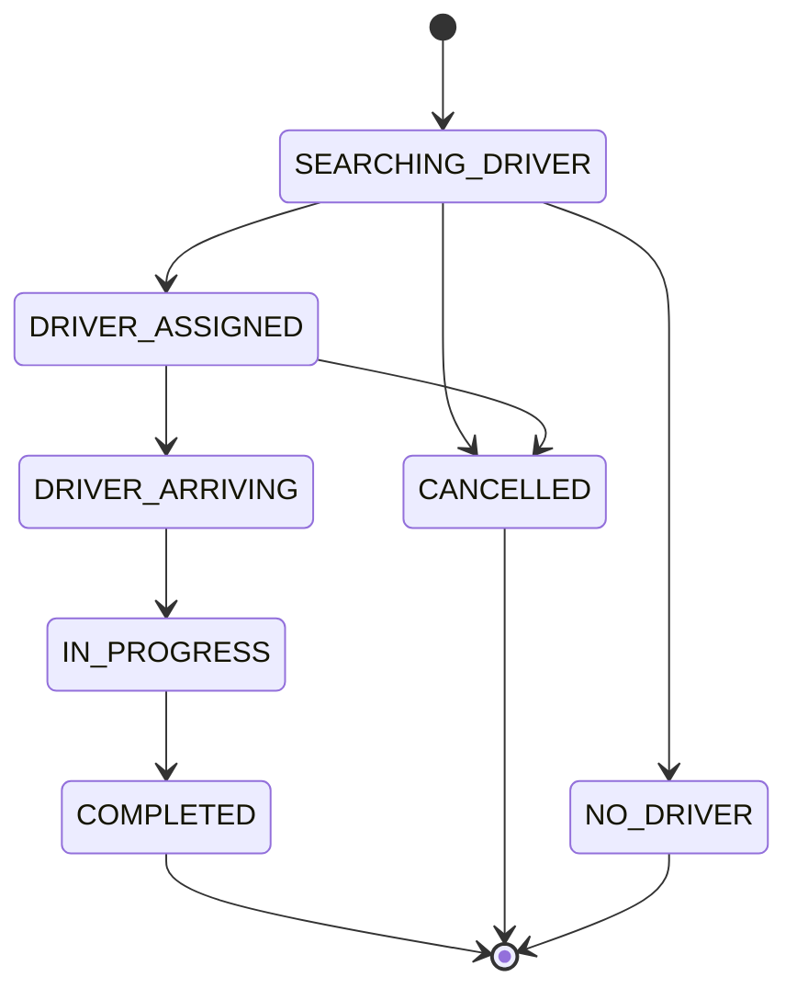

Invariant:

```text
Pickup != Destination

VehicleType ∈ {BIKE, CAR}

Customer không có Ride active khác

COMPLETED yêu cầu:
final_fare
+
actual_distance_km

COMPLETED không được CANCEL
```

---

## 4.5. DriverRequest Aggregate

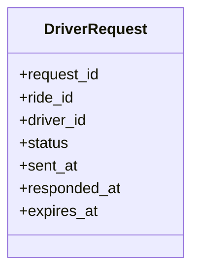

Invariant:

```text
SENT
 ├── ACCEPTED
 ├── DECLINED
 └── EXPIRED
```

```text
Thời hạn = 30 giây

Ride phải SEARCHING_DRIVER

Driver phải AVAILABLE

Driver đúng VehicleType

Driver nằm trong 5 km

(ride_id, driver_id) không được gửi trùng

chỉ ACCEPTED hợp lệ đầu tiên được gán Ride
```

Tổng thời gian tìm Driver:

```text
<= 3 phút
```

Nếu hết thời gian:

```text
Ride → NO_DRIVER
```

---

## 4.6. Payment Aggregate

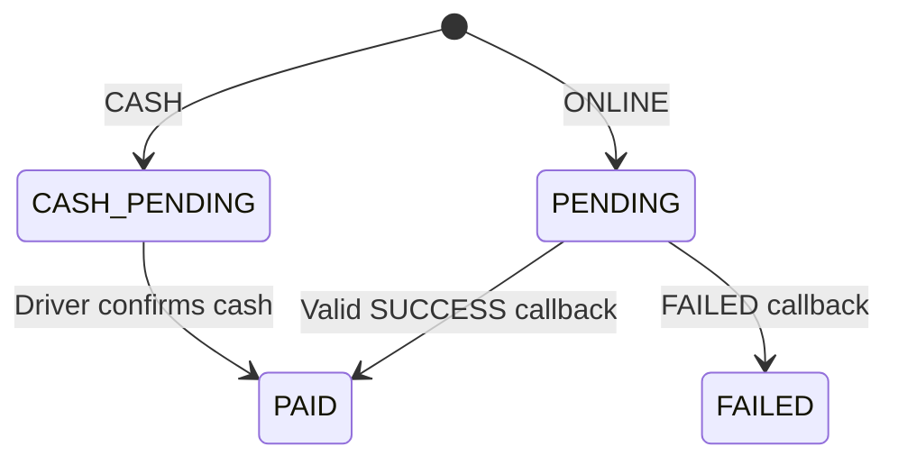

Invariant:

```text
Ride.status = COMPLETED

Payment.amount = Ride.final_fare

một Ride tối đa một Payment hợp lệ

callback ONLINE phải hợp lệ

callback lặp không được tạo Payment mới

FAILED không đồng nghĩa PAID
```

---

## 4.7. Rating Aggregate

Invariant:

```text
Ride.status = COMPLETED

Customer phải là Customer của Ride

Ride chưa có Rating

1 <= score <= 5
```

Sau khi lưu Rating:

```text
Driver.rating
được cập nhật lại
```

---

## 4.8. Incident Aggregate

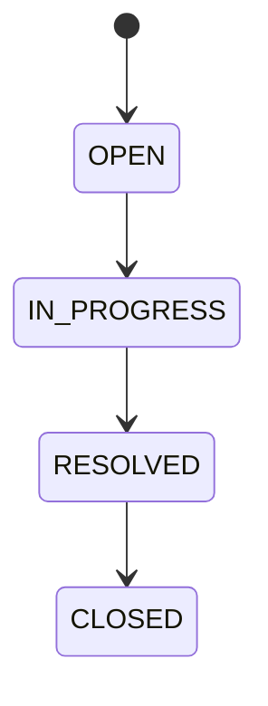

Incident phải tham chiếu đến một Ride tồn tại.

---

# 5. DOMAIN EVENT PHÁT SINH TỪ USE CASE

> **[BỔ SUNG KỸ THUẬT]** Repository chưa đặt tên Domain Event. Các tên dưới đây mô tả trực tiếp những thay đổi đã tồn tại trong Use Case/API.

| Domain Event                  | Nguồn                   | Producer          | Consumer chính                      | Mục đích                       |
| ----------------------------- | ----------------------- | ----------------- | ----------------------------------- | ------------------------------ |
| `user.registered`             | Register API            | Identity & User   | Driver Management khi Role = DRIVER | Ghi nhận User mới              |
| `driver.availability_changed` | Driver availability API | Driver Management | Dispatch                            | Cập nhật khả năng nhận Ride    |
| `ride.created`                | UC01                    | Ride Management   | Dispatch                            | Bắt đầu tìm Driver             |
| `driver_request.sent`         | UC02                    | Dispatch          | Driver/client delivery              | Gửi yêu cầu nhận Ride          |
| `driver_request.accepted`     | UC02                    | Dispatch          | Ride, Driver                        | Gán Driver và chuyển BUSY      |
| `driver_request.declined`     | UC02                    | Dispatch          | Dispatch                            | Chuyển sang Driver khác        |
| `driver_request.expired`      | UC02                    | Dispatch          | Dispatch                            | Chuyển sang Driver khác        |
| `ride.driver_assigned`        | UC02                    | Dispatch/Ride     | Ride tracking                       | Chuyển `DRIVER_ASSIGNED`       |
| `ride.no_driver`              | UC02                    | Dispatch          | Ride                                | Chuyển `NO_DRIVER`             |
| `ride.status_changed`         | UC03/UC04               | Ride              | Operations                          | Đồng bộ trạng thái             |
| `ride.completed`              | UC04                    | Ride              | Payment, Rating, Operations         | Mở điều kiện Payment/Rating    |
| `ride.cancelled`              | UC06                    | Ride              | Dispatch/Driver/Operations          | Giải phóng xử lý liên quan     |
| `payment.created`             | UC05                    | Payment           | —                                   | Ghi nhận Payment               |
| `payment.paid`                | UC05                    | Payment           | Operations / client notification    | Ghi nhận thanh toán thành công |
| `payment.failed`              | UC05                    | Payment           | Operations / client notification    | Ghi nhận thất bại              |
| `rating.created`              | UC07                    | Rating            | Driver Management                   | Cập nhật điểm Driver           |
| `incident.created`            | UC09                    | Operations        | —                                   | Ghi nhận sự cố                 |

---

## 5.1. Luồng Event UC01 → UC02

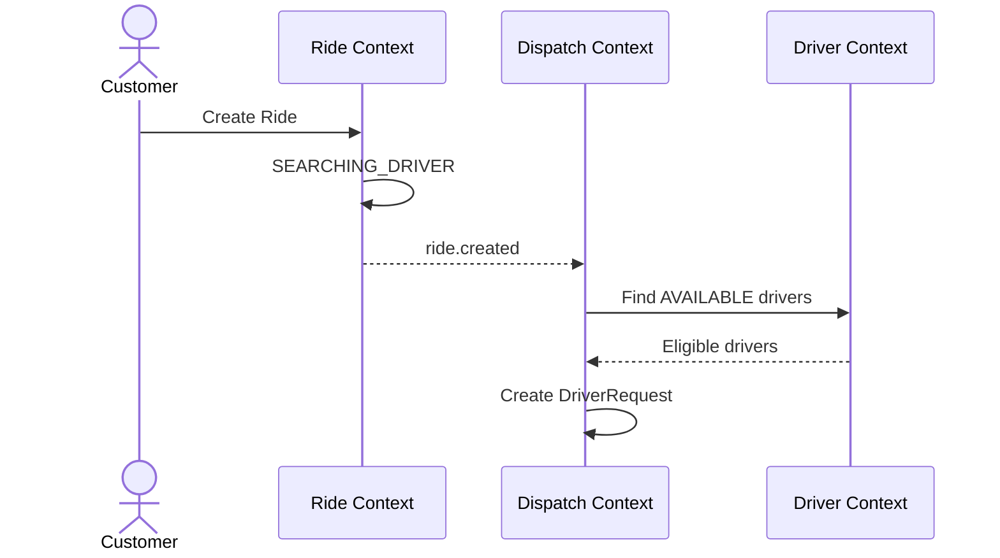

---

## 5.2. Driver Accept / Reject / Timeout

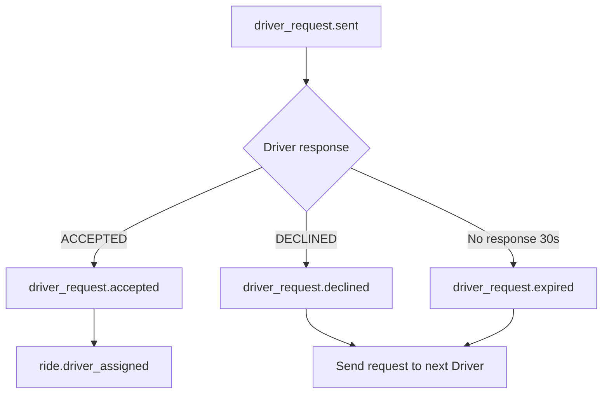

---

## 5.3. Ride Completion Flow

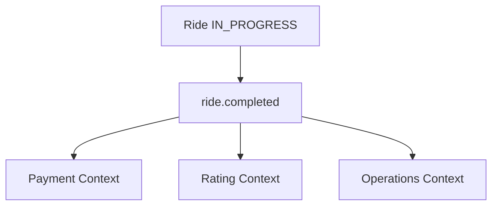

---

# 6. ÁNH XẠ CONTEXT SANG MICRO-SERVICE

Repository hiện tại phù hợp với **7 Microservice nghiệp vụ**.

| Bounded Context           | Service triển khai   | Database sở hữu | Giao tiếp chính        |
| ------------------------- | -------------------- | --------------- | ---------------------- |
| Identity & User           | `identity-service`   | `identity_db`   | REST qua Gateway       |
| Driver Management         | `driver-service`     | `driver_db`     | REST + Event           |
| Ride Management           | `ride-service`       | `ride_db`       | REST + Event + Map API |
| Dispatch & Driver Request | `dispatch-service`   | `dispatch_db`   | REST nội bộ + Event    |
| Payment                   | `payment-service`    | `payment_db`    | REST + Payment Gateway |
| Rating                    | `rating-service`     | `rating_db`     | REST + Event           |
| Operations                | `operations-service` | `operations_db` | REST + Query/Event     |

---

## 6.1. Vì sao không tạo Notification Service riêng?

Repository có FR11 yêu cầu thông báo trạng thái nhưng:

* không có Notification Entity;
* không có Notification API;
* không có Notification Test Case;
* không có quy tắc lưu Notification.

Vì vậy trong thiết kế này **không tự tạo `notification-service`**.

Notification được xem là hành động phát sinh từ:

```text
DriverRequest
RideStatus
Payment
```

và có thể được triển khai thông qua cơ chế push/client delivery ở tầng hạ tầng.

---

## 6.2. Vì sao không tạo Pricing Service riêng?

API hiện tại quy định:

```text
POST /rides/estimate
```

trong `rides.yaml`.

Do đó chức năng tính giá dự kiến thuộc:

```text
ride-service
```

Không tách `pricing-service`.

---

## 6.3. Kiến trúc tổng thể

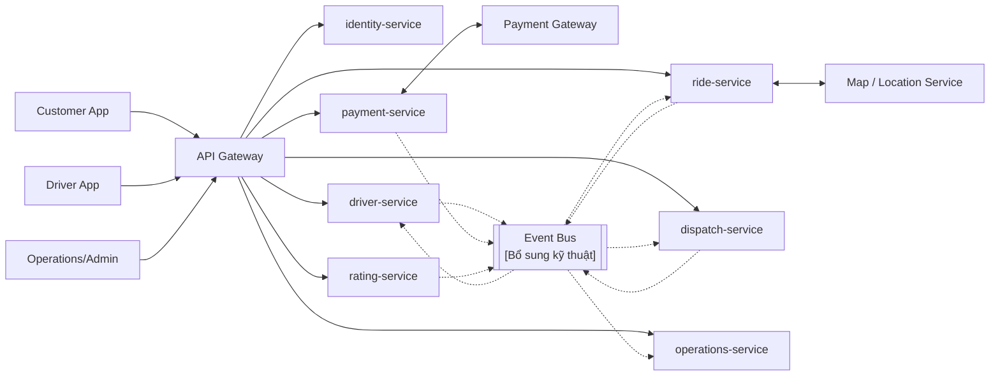

Event Bus là lựa chọn kỹ thuật nhằm đáp ứng NFR08, NFR11 và tránh truy cập database xuyên service.

---

# 7. MÔ TẢ SERVICE

## 7.1. Identity Service

### Bounded Context

`Identity & User`

### API hiện có

```text
POST  /auth/register
POST  /auth/login

GET   /users/me
PATCH /users/me
```

### Trách nhiệm

```text
Đăng ký
Đăng nhập
JWT Authentication
User Profile
Role
User Status
Phone uniqueness
```

### Dữ liệu sở hữu

```text
User
Credential/password_hash
```

### Không sở hữu

```text
Driver
Vehicle
Ride
Payment
Rating
```

---

## 7.2. Driver Service

### API hiện có

```text
PUT   /drivers/me
PATCH /drivers/me/availability
```

### Trách nhiệm

```text
Driver Profile
Vehicle
Vehicle Type
License Plate
Driver Rating
Availability
Current Location
```

### Quy tắc

```text
Driver đang có Ride active
→ không được tự chuyển sang trạng thái gây xung đột

license_plate duy nhất

VehicleType = BIKE hoặc CAR
```

### Event

```text
driver.availability_changed
rating.created → cập nhật Driver.rating
```

---

## 7.3. Ride Service

### API hiện có

```text
POST  /rides/estimate

POST  /rides
GET   /rides

GET   /rides/{ride_id}

PATCH /rides/{ride_id}/status

POST  /rides/{ride_id}/cancel
```

### Trách nhiệm

```text
Estimate Ride
Create Ride
Idempotency
Ride History
Ride Tracking
Ride Status
Ride Cancellation
Final Fare
Actual Distance
```

### External dependency

```text
Map / Location Service
```

### Event

```text
ride.created
ride.status_changed
ride.completed
ride.cancelled
ride.no_driver
```

---

## 7.4. Dispatch Service

### API hiện có

```text
POST /rides/{ride_id}/driver-requests

POST /driver-requests/{request_id}/respond
```

### Trách nhiệm

```text
Find AVAILABLE Driver
5 km radius
VehicleType filtering
Rating preference
Distance preference
Create DriverRequest
30-second timeout
Accept
Decline
Expire
3-minute total search
Concurrency protection
```

### Dữ liệu sở hữu

```text
DriverRequest
```

### Không sở hữu

```text
Driver Profile
Ride Aggregate
```

Service chỉ tham chiếu:

```text
driver_id
ride_id
```

---

## 7.5. Payment Service

### API hiện có

```text
POST /rides/{ride_id}/payments

POST /payments/{payment_id}/cash-confirmation

POST /payments/callback
```

### Trách nhiệm

```text
Create Payment
CASH
ONLINE
Payment Idempotency
Cash Confirmation
Gateway Callback
Callback Signature Validation
Payment Status
Provider Transaction ID
```

### External dependency

```text
Payment Gateway
```

---

## 7.6. Rating Service

### API hiện có

```text
POST /rides/{ride_id}/rating
```

### Trách nhiệm

```text
Validate Ride COMPLETED
Validate Customer owns Ride
Validate Score 1-5
Prevent duplicate Rating
Save Comment
Trigger Driver rating update
```

---

## 7.7. Operations Service

### API hiện có

```text
GET  /operations/rides/active

POST /operations/incidents
```

### Trách nhiệm

```text
View active Rides
Operations authorization
Incident creation
Incident type
Incident priority
Incident status
```

Active Ride là dữ liệu thuộc `ride-service`.

Vì vậy:

```text
operations-service
       ↓ REST/query
ride-service
```

Không query trực tiếp `ride_db`.

---

# 8. MÔ HÌNH DỮ LIỆU CHO TỪNG SERVICE

# 8.1. Identity Service — `identity_db`

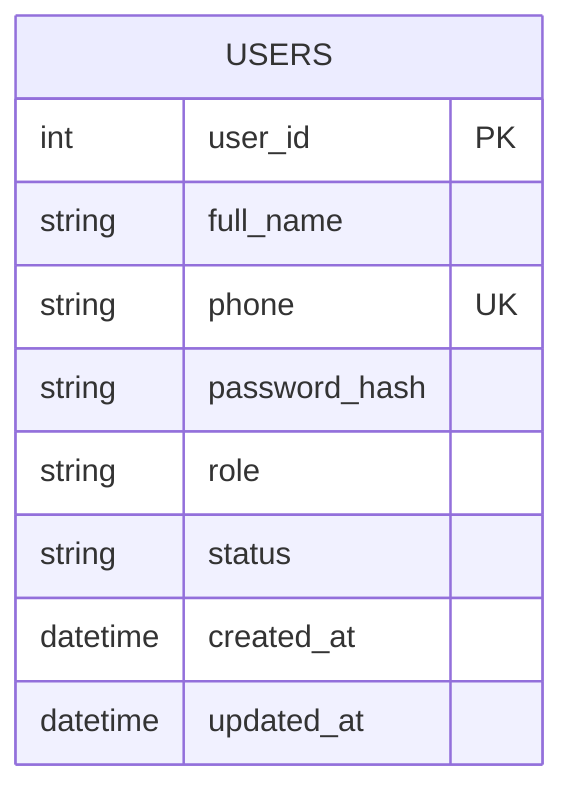

### Constraint

```text
phone UNIQUE

role:
CUSTOMER
DRIVER
OPERATIONS
ADMIN

status:
ACTIVE
INACTIVE
LOCKED
```

`password_hash` là bổ sung kỹ thuật trực tiếp từ NFR05.

---

# 8.2. Driver Service — `driver_db`

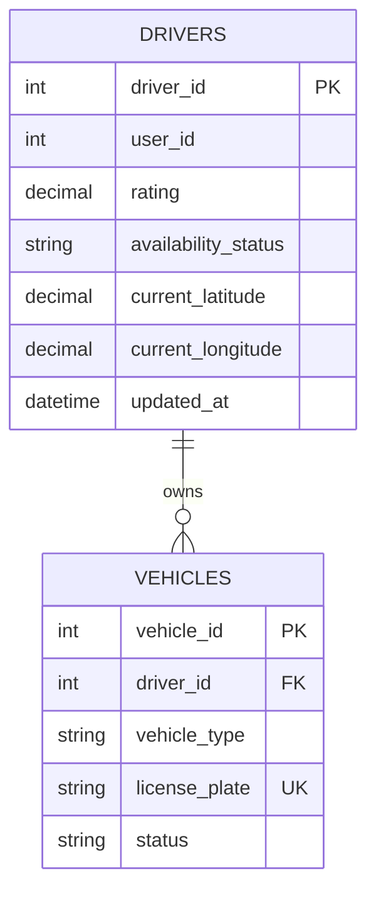

`user_id` là logical reference sang `identity-service`, không phải Foreign Key xuyên database.

### Constraint

```text
availability_status:
AVAILABLE
OFFLINE
BUSY
```

```text
vehicle_type:
BIKE
CAR
```

```text
license_plate UNIQUE
```

---

# 8.3. Ride Service — `ride_db`

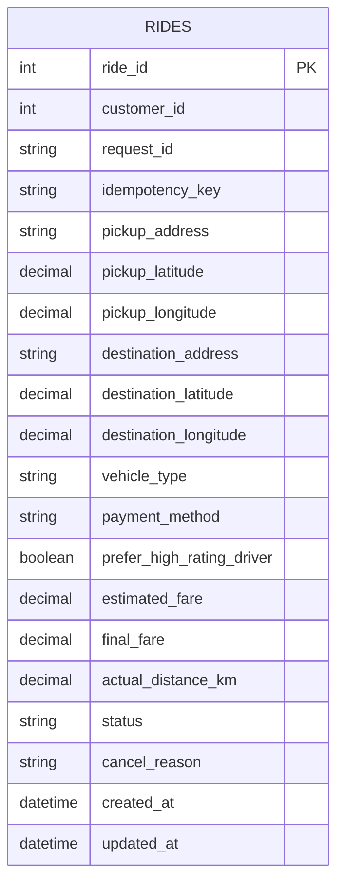

### Logical References

```text
customer_id → identity-service
```

### Constraint

```text
request_id UNIQUE
idempotency_key UNIQUE
```

```text
vehicle_type:
BIKE
CAR
```

```text
status:
SEARCHING_DRIVER
DRIVER_ASSIGNED
DRIVER_ARRIVING
IN_PROGRESS
COMPLETED
CANCELLED
NO_DRIVER
```

Khi `status = COMPLETED`:

```text
final_fare NOT NULL
actual_distance_km NOT NULL
```

---

# 8.4. Dispatch Service — `dispatch_db`

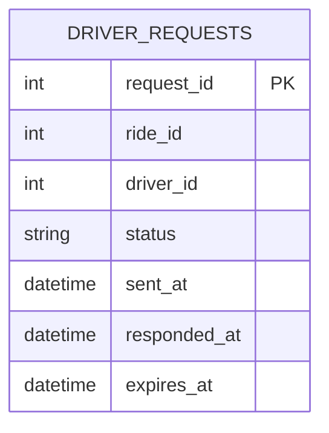

Logical references:

```text
ride_id   → ride-service
driver_id → driver-service
```

Constraint nghiệp vụ:

```text
UNIQUE (ride_id, driver_id)
```

nhằm đáp ứng yêu cầu:

> Hệ thống không gửi trùng cùng một Ride đến cùng một Driver.

### DriverRequest Status

```text
SENT
ACCEPTED
DECLINED
EXPIRED
```

---

# 8.5. Payment Service — `payment_db`

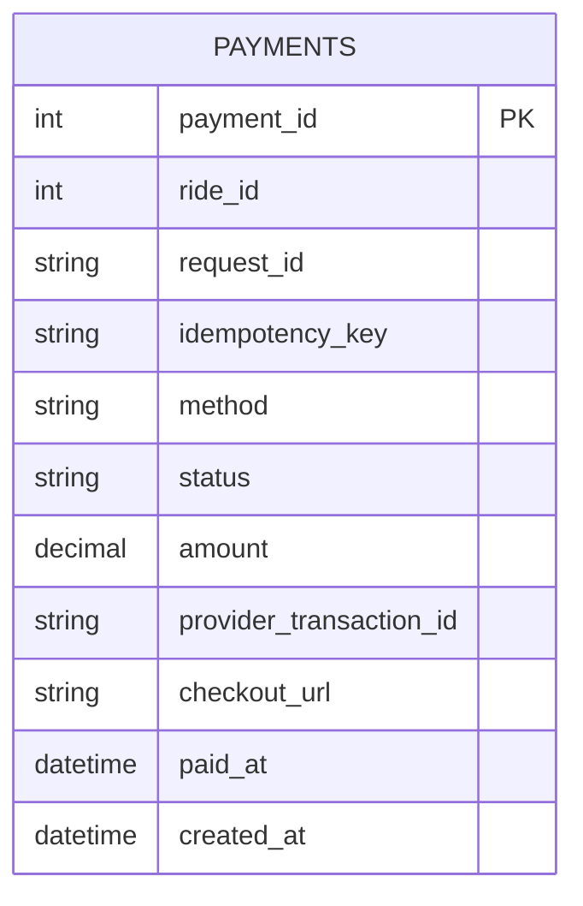

Logical reference:

```text
ride_id → ride-service
```

Constraint:

```text
ride_id UNIQUE
```

```text
request_id UNIQUE
idempotency_key UNIQUE
```

### Method

```text
CASH
ONLINE
```

### Status

```text
CASH_PENDING
PENDING
PAID
FAILED
```

Không lưu thông tin thẻ nhạy cảm.

---

# 8.6. Rating Service — `rating_db`

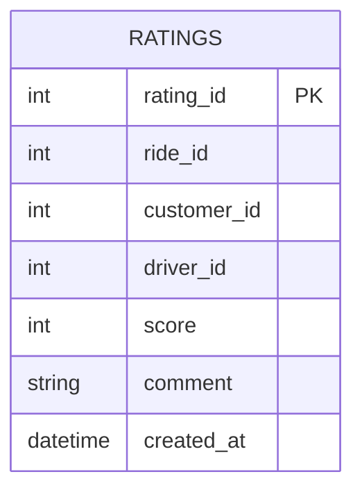

Logical references:

```text
ride_id     → ride-service
customer_id → identity-service
driver_id   → driver-service
```

Constraint:

```text
ride_id UNIQUE
```

```text
1 <= score <= 5
```

---

# 8.7. Operations Service — `operations_db`

Repository đã có Operations API nhưng Entity `Incident` chưa được đưa vào ERD ban đầu, vì vậy bổ sung:

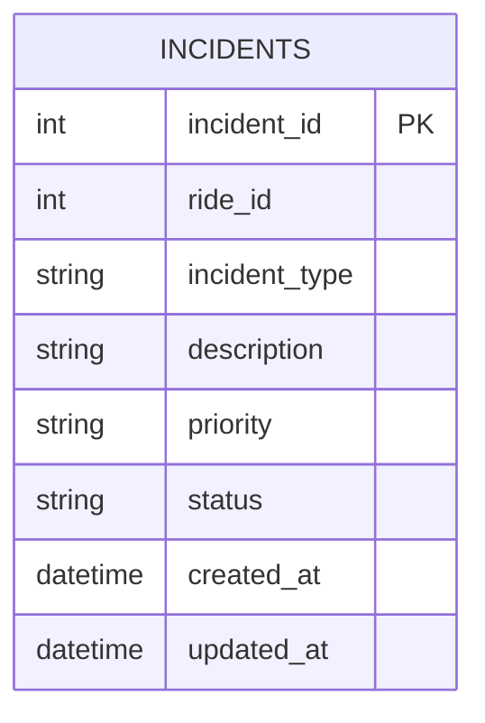

`ride_id` là logical reference tới `ride-service`.

### Incident Type

```text
SAFETY
PAYMENT
DRIVER
CUSTOMER
TECHNICAL
OTHER
```

### Priority

```text
LOW
MEDIUM
HIGH
```

### Status

```text
OPEN
IN_PROGRESS
RESOLVED
CLOSED
```

Không tạo bảng Ride copy trong `operations_db`.

Endpoint:

```text
GET /operations/rides/active
```

sử dụng dữ liệu do `ride-service` cung cấp.

---

# 9. MÔ HÌNH DỮ LIỆU LOGIC TOÀN HỆ THỐNG

> Sơ đồ này chỉ mô tả **quan hệ logic**, không có Foreign Key xuyên Microservice.

```mermaid
erDiagram
    USER {
        int user_id PK
    }

    DRIVER {
        int driver_id PK
        int user_id
    }

    VEHICLE {
        int vehicle_id PK
        int driver_id
    }

    RIDE {
        int ride_id PK
        int customer_id
    }

    DRIVER_REQUEST {
        int request_id PK
        int ride_id
        int driver_id
    }

    PAYMENT {
        int payment_id PK
        int ride_id
    }

    RATING {
        int rating_id PK
        int ride_id
        int customer_id
        int driver_id
    }

    INCIDENT {
        int incident_id PK
        int ride_id
    }

    USER ||--o| DRIVER : logical
    DRIVER ||--o{ VEHICLE : owns

    USER ||--o{ RIDE : creates

    RIDE ||--o{ DRIVER_REQUEST : produces
    DRIVER ||--o{ DRIVER_REQUEST : receives

    RIDE ||--o| PAYMENT : has
    RIDE ||--o| RATING : has

    USER ||--o{ RATING : writes
    DRIVER ||--o{ RATING : receives

    RIDE ||--o{ INCIDENT : related
```

---

# 10. DATABASE PER SERVICE

```mermaid
flowchart TB
    ID["identity-service"] --> IDDB[("identity_db")]

    DRIVER["driver-service"] --> DDB[("driver_db")]

    RIDE["ride-service"] --> RDB[("ride_db")]

    DISPATCH["dispatch-service"] --> DISDB[("dispatch_db")]

    PAYMENT["payment-service"] --> PDB[("payment_db")]

    RATING["rating-service"] --> RATDB[("rating_db")]

    OPS["operations-service"] --> ODB[("operations_db")]
```

Quy tắc:

```text
identity-service
    WRITE identity_db

driver-service
    WRITE driver_db

ride-service
    WRITE ride_db

dispatch-service
    WRITE dispatch_db

payment-service
    WRITE payment_db

rating-service
    WRITE rating_db

operations-service
    WRITE operations_db
```

---

# 11. LUỒNG MICRO-SERVICE HOÀN CHỈNH

## 11.1. Tạo Ride và tìm Driver

```mermaid
sequenceDiagram
    actor C as Customer

    participant GW as API Gateway
    participant ID as identity-service
    participant R as ride-service
    participant M as Map Service
    participant D as dispatch-service
    participant DR as driver-service

    C->>GW: POST /rides/estimate
    GW->>R: Estimate Ride

    R->>M: Distance / route
    M-->>R: Distance + duration

    R-->>C: Estimated fare

    C->>GW: POST /rides

    GW->>R: Create Ride
    R->>R: Validate idempotency
    R->>R: Save SEARCHING_DRIVER

    R-->>D: ride.created

    D->>DR: Find eligible Drivers
    DR-->>D: AVAILABLE + location + vehicle + rating

    D->>D: Filter <= 5 km
    D->>D: Filter VehicleType
    D->>D: Apply rating/distance preference

    D->>D: Create DriverRequest
```

---

## 11.2. Driver nhận hoặc từ chối

```mermaid
sequenceDiagram
    actor Driver

    participant GW as API Gateway
    participant D as dispatch-service
    participant R as ride-service
    participant DS as driver-service

    Driver->>GW: POST /driver-requests/{id}/respond

    GW->>D: ACCEPTED / DECLINED

    alt ACCEPTED and request valid
        D->>D: DriverRequest = ACCEPTED

        D-->>R: driver_request.accepted
        R->>R: Ride = DRIVER_ASSIGNED

        D-->>DS: Driver assigned
        DS->>DS: Availability = BUSY

    else DECLINED
        D->>D: DriverRequest = DECLINED
        D->>D: Find next Driver

    else timeout > 30 seconds
        D->>D: DriverRequest = EXPIRED
        D->>D: Find next Driver
    end
```

---

## 11.3. Thực hiện Ride

```mermaid
sequenceDiagram
    actor Driver

    participant GW as API Gateway
    participant R as ride-service

    Driver->>GW: DRIVER_ARRIVING
    GW->>R: PATCH Ride Status
    R->>R: Validate transition

    Driver->>GW: IN_PROGRESS
    GW->>R: PATCH Ride Status
    R->>R: Validate transition

    Driver->>GW: COMPLETED + final_fare + distance
    GW->>R: PATCH Ride Status

    R->>R: Save COMPLETED
    R-->>R: ride.completed
```

---

## 11.4. Payment

```mermaid
sequenceDiagram
    actor Customer
    actor Driver

    participant GW as API Gateway
    participant R as ride-service
    participant P as payment-service
    participant PG as Payment Gateway

    Customer->>GW: POST /rides/{ride_id}/payments

    GW->>P: Create Payment

    P->>R: Verify Ride COMPLETED / final_fare
    R-->>P: Ride data

    alt CASH
        P->>P: CASH_PENDING

        Driver->>GW: Confirm Cash
        GW->>P: collected_amount

        P->>P: Validate amount
        P->>P: PAID

    else ONLINE
        P->>P: PENDING

        P->>PG: Create online transaction
        PG-->>P: checkout URL

        PG->>P: Payment Callback

        alt SUCCESS + valid signature
            P->>P: PAID
        else FAILED
            P->>P: FAILED
        end
    end
```

---

## 11.5. Rating

```mermaid
sequenceDiagram
    actor Customer

    participant GW as API Gateway
    participant R as rating-service
    participant Ride as ride-service
    participant D as driver-service

    Customer->>GW: POST /rides/{ride_id}/rating

    GW->>R: Score + Comment

    R->>Ride: Verify Ride COMPLETED + ownership
    Ride-->>R: Ride data

    R->>R: Validate unique Rating
    R->>R: Validate 1 <= Score <= 5
    R->>R: Save Rating

    R-->>D: rating.created
    D->>D: Update average rating
```

---

# 12. TỔNG KẾT THIẾT KẾ

Quy trình thiết kế Microservice CAB SYSTEM:

```text
SRS
 ↓
BR / FR / UC
 ↓
Bounded Context
 ↓
Ubiquitous Language
 ↓
Aggregate + Invariant
 ↓
Domain Event
 ↓
Microservice
 ↓
Database per Service
```

Kiến trúc nghiệp vụ cốt lõi:

```text
Customer
   ↓
ride-service
   ↓
dispatch-service
   ↕
driver-service
   ↓
Ride thực hiện
   ↓
COMPLETED
   ├───────────────┐
   ↓               ↓
payment-service   rating-service
```

Các service của CAB SYSTEM:

| Microservice         | Trách nhiệm chính                          |
| -------------------- | ------------------------------------------ |
| `identity-service`   | Authentication + User Profile              |
| `driver-service`     | Driver + Vehicle + Availability + Location |
| `ride-service`       | Estimate + Ride lifecycle + Cancellation   |
| `dispatch-service`   | DriverRequest + Matching                   |
| `payment-service`    | CASH + ONLINE Payment                      |
| `rating-service`     | Driver Rating                              |
| `operations-service` | Active Ride Monitoring + Incident          |

Các hệ thống ngoài CAB SYSTEM:

```text
Map / Location Service
Payment Gateway
```

Không tạo riêng:

```text
notification-service
pricing-service
customer-service
trip-service
```

vì repository hiện tại không có ranh giới dữ liệu/API riêng tương ứng.

`Ride` trong repository đã bao gồm cả:

```text
Đặt chuyến
Theo dõi chuyến
Thực hiện chuyến
Hoàn tất chuyến
Hủy chuyến
```

nên giữ toàn bộ trong `ride-service` sẽ nhất quán hơn với SRS, API và Test Case hiện có.

---

# 13. PHẦN BỔ SUNG NÊN ĐƯA TRỞ LẠI `srs.md`

Để repository đủ cơ sở cho tài liệu Microservice, nên bổ sung một mục mới sau phần Use Case:

```markdown
## 12. Microservice Design Constraints

### 12.1. Service ownership

- Identity Service owns User and authentication data.
- Driver Service owns Driver and Vehicle.
- Ride Service owns Ride.
- Dispatch Service owns DriverRequest.
- Payment Service owns Payment.
- Rating Service owns Rating.
- Operations Service owns Incident.

A service must not directly modify another service's database.

### 12.2. Logical references

Cross-service IDs such as user_id, driver_id and ride_id are logical references.
Foreign keys are only used between tables in the same service database.

### 12.3. Idempotency

- Ride creation must use request_id and Idempotency-Key.
- Payment creation must use request_id and Idempotency-Key.
- Repeated requests must not create duplicate Ride or Payment records.

### 12.4. Integration events

The following technical events may be used between services:

- user.registered
- driver.availability_changed
- ride.created
- driver_request.sent
- driver_request.accepted
- driver_request.declined
- driver_request.expired
- ride.driver_assigned
- ride.no_driver
- ride.status_changed
- ride.completed
- ride.cancelled
- payment.created
- payment.paid
- payment.failed
- rating.created
- incident.created

These events do not introduce new business requirements. They represent state changes already defined by the existing use cases.

### 12.5. External integrations

- Ride Service integrates with Map/Location Service.
- Payment Service integrates with Payment Gateway.
- External service failures must follow NFR08 retry and recovery requirements.

### 12.6. Additional persistence fields

Ride:
- request_id
- idempotency_key
- payment_method
- prefer_high_rating_driver
- actual_distance_km
- cancel_reason

DriverRequest:
- expires_at

Payment:
- request_id
- idempotency_key
- checkout_url

User:
- password_hash

Operations:
- Incident entity as defined by operations.yaml
```

Phần bổ sung trên không tạo ra Business Requirement mới mà chỉ đưa những dữ liệu đã tồn tại rải rác trong API, Test Case và NFR về một nơi thống nhất để phục vụ thiết kế kỹ thuật.
