# THIẾT KẾ MICRO-SERVICE – CAB SYSTEM

# 1. Phân tách Use Case theo miền nghiệp vụ

## 1.1. Các Actor của hệ thống

Theo `srs.md`, hệ thống có các Actor chính:

| Mã  | Actor                | Vai trò                                                    |
| --- | -------------------- | ---------------------------------------------------------- |
| A01 | Customer             | Đặt chuyến, theo dõi, thanh toán, đánh giá                 |
| A02 | Driver               | Cập nhật trạng thái, nhận/từ chối chuyến, thực hiện chuyến |
| A03 | Operations Staff     | Theo dõi chuyến, xử lý sự cố                               |
| A04 | System Administrator | Quản lý tài khoản, cấu hình và báo cáo                     |
| A05 | Payment Gateway      | Xử lý thanh toán trực tuyến                                |
| A06 | Map/Location Service | Cung cấp tọa độ, khoảng cách, định tuyến                   |

---

## 1.2. Danh sách Use Case

| Mã   | Use Case                      | Actor chính              | Miền nghiệp vụ |
| ---- | ----------------------------- | ------------------------ | -------------- |
| UC01 | Đặt chuyến                    | Customer                 | Ride           |
| UC02 | Tìm và nhận chuyến            | Driver/System            | Dispatch       |
| UC03 | Theo dõi chuyến               | Customer, Driver         | Ride           |
| UC04 | Thực hiện và hoàn tất chuyến  | Driver                   | Ride           |
| UC05 | Thanh toán chuyến             | Customer/Payment Gateway | Payment        |
| UC06 | Hủy chuyến                    | Customer/Driver          | Ride           |
| UC07 | Đánh giá tài xế               | Customer                 | Rating         |
| UC08 | Quản lý tài khoản và cấu hình | Administrator            | Identity/User  |
| UC09 | Hỗ trợ và xử lý sự cố         | Operations               | Operations     |

---

## 1.3. Phân chia miền nghiệp vụ

Từ Use Case và API hiện có, có thể chia hệ thống thành các miền:

### Identity & Access

Phụ trách:

* Đăng ký tài khoản
* Đăng nhập
* JWT
* Role
* Trạng thái tài khoản

API:

```text
POST /auth/register
POST /auth/login
```

---

### User Management

Phụ trách thông tin người dùng:

```text
GET   /users/me
PATCH /users/me
```

Các thông tin chính:

* user_id
* full_name
* phone
* role
* status

---

### Driver Management

Phụ trách:

* Hồ sơ Driver
* Phương tiện
* Trạng thái sẵn sàng
* Vị trí hiện tại

API:

```text
PUT   /drivers/me
PATCH /drivers/me/availability
```

---

### Ride Management

Đây là miền nghiệp vụ trung tâm:

```text
POST /rides/estimate
POST /rides
GET  /rides
GET  /rides/{ride_id}
PATCH /rides/{ride_id}/status
POST /rides/{ride_id}/cancel
```

Phụ trách:

* Điểm đón
* Điểm đến
* Loại xe
* Giá dự kiến
* Giá cuối
* Trạng thái chuyến
* Hủy chuyến
* Lịch sử chuyến

---

### Driver Dispatch

Phụ trách quá trình tìm và phân công tài xế:

```text
POST /rides/{ride_id}/driver-requests
POST /driver-requests/{request_id}/respond
```

Các nghiệp vụ quan trọng:

* Tìm Driver trong bán kính 5 km
* Lọc theo loại xe
* Ưu tiên Driver có rating cao nếu Customer yêu cầu
* Gửi request
* Driver nhận/từ chối
* Request hết hạn sau 30 giây
* Tối đa khoảng 3 phút tìm Driver

---

### Payment

Phụ trách:

* Thanh toán CASH
* Thanh toán ONLINE
* Cash confirmation
* Payment Gateway callback
* Idempotency

API:

```text
POST /rides/{ride_id}/payments
POST /payments/{payment_id}/cash-confirmation
POST /payments/callback
```

---

### Rating

Phụ trách đánh giá Driver:

```text
POST /rides/{ride_id}/rating
```

Rule:

* Ride phải `COMPLETED`
* Customer phải là người đặt chuyến
* Score từ 1 đến 5
* Một Ride chỉ được Rating một lần

---

### Operations

Phụ trách:

```text
GET  /operations/rides/active
POST /operations/incidents
```

Bao gồm:

* Theo dõi các chuyến đang hoạt động
* Lọc theo trạng thái
* Ghi nhận sự cố
* Hỗ trợ vận hành

---

## 1.4. Sơ đồ phân tách Use Case

```mermaid
flowchart TB

    Customer[Customer]
    Driver[Driver]
    Admin[Administrator]
    Ops[Operations Staff]
    Gateway[Payment Gateway]
    Map[Map/Location Service]

    subgraph Identity["Identity & User"]
        Auth["Authentication"]
        User["User Management"]
    end

    subgraph Ride["Ride Management"]
        Estimate["Fare Estimation"]
        CreateRide["Create Ride"]
        Tracking["Ride Tracking"]
        Status["Ride Status"]
        Cancel["Cancel Ride"]
    end

    subgraph Dispatch["Driver Dispatch"]
        FindDriver["Find Driver"]
        DriverRequest["Driver Request"]
    end

    subgraph DriverDomain["Driver Management"]
        DriverProfile["Driver Profile"]
        Availability["Availability & Location"]
    end

    subgraph Payment["Payment"]
        CreatePayment["Create Payment"]
        Cash["Cash Confirmation"]
        Callback["Payment Callback"]
    end

    subgraph Rating["Rating"]
        Rate["Rate Driver"]
    end

    subgraph Operations["Operations"]
        Monitor["Monitor Active Rides"]
        Incident["Incident Management"]
    end

    Customer --> Auth
    Customer --> User
    Customer --> Estimate
    Customer --> CreateRide
    Customer --> Tracking
    Customer --> Cancel
    Customer --> CreatePayment
    Customer --> Rate

    Driver --> Auth
    Driver --> DriverProfile
    Driver --> Availability
    Driver --> DriverRequest
    Driver --> Status
    Driver --> Cancel
    Driver --> Cash

    Admin --> User
    Ops --> Monitor
    Ops --> Incident

    Gateway --> Callback
    Map --> Estimate
```

---

# 2. Ubiquitous Language

Các thuật ngữ dùng thống nhất trong toàn hệ thống:

| Thuật ngữ           | Ý nghĩa                                 |
| ------------------- | --------------------------------------- |
| User                | Tài khoản người dùng                    |
| Customer            | Người đặt chuyến                        |
| Driver              | Tài xế                                  |
| Ride                | Một chuyến đi                           |
| Pickup              | Điểm đón                                |
| Destination         | Điểm đến                                |
| Vehicle             | Phương tiện                             |
| Vehicle Type        | Loại phương tiện `BIKE` hoặc `CAR`      |
| Driver Request      | Yêu cầu chuyến gửi đến một Driver       |
| Availability Status | Trạng thái sẵn sàng của Driver          |
| Ride Status         | Trạng thái hiện tại của Ride            |
| Estimated Fare      | Giá dự kiến                             |
| Final Fare          | Giá cuối cùng                           |
| Payment             | Giao dịch thanh toán                    |
| Cash Pending        | Trạng thái chờ Driver xác nhận tiền mặt |
| Payment Gateway     | Đối tác xử lý thanh toán online         |
| Rating              | Đánh giá Customer dành cho Driver       |
| Incident            | Sự cố của chuyến                        |
| Idempotency-Key     | Khóa chống tạo dữ liệu trùng            |
| Request ID          | Mã yêu cầu nghiệp vụ                    |
| Callback            | Thông báo kết quả từ Payment Gateway    |

---

# 3. Bounded Context và Context Map

## 3.1. Các Bounded Context

Từ các API hiện tại, đề xuất các Bounded Context:

| Bounded Context    | Trách nhiệm                             |
| ------------------ | --------------------------------------- |
| Identity Context   | Authentication và quyền truy cập        |
| User Context       | Hồ sơ User                              |
| Driver Context     | Driver, Vehicle, availability, location |
| Ride Context       | Vòng đời Ride                           |
| Dispatch Context   | Tìm và phân công Driver                 |
| Payment Context    | Payment và Payment Gateway              |
| Rating Context     | Rating Driver                           |
| Operations Context | Theo dõi và xử lý Incident              |

---

## 3.2. Context Map

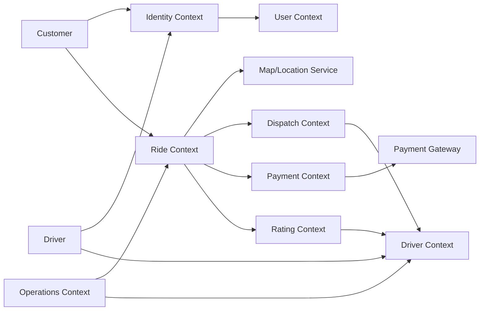

---

## 3.3. Luồng nghiệp vụ chính

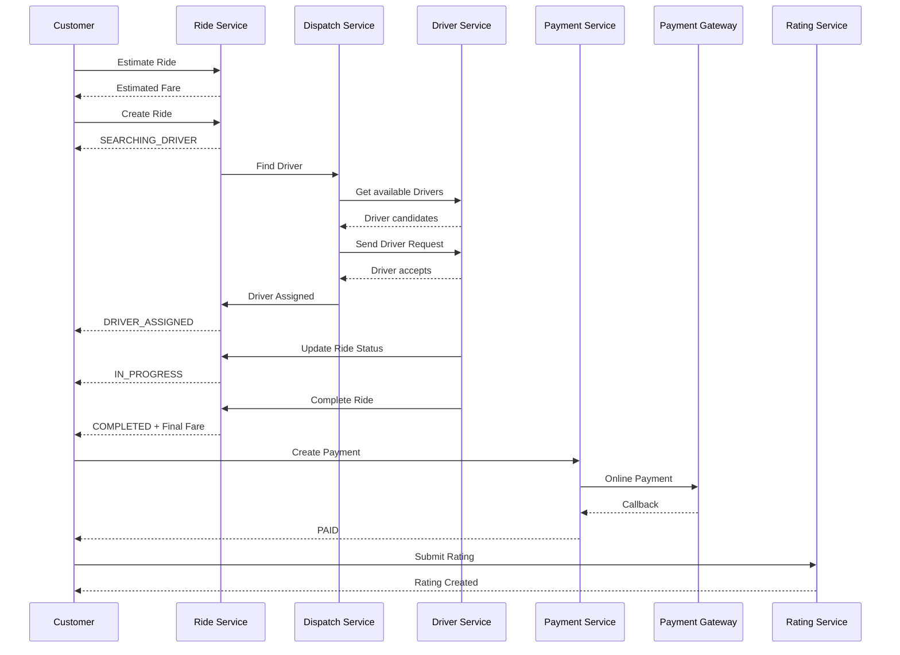

---

# 4. Aggregate và Invariant

## 4.1. Identity Aggregate

### Aggregate Root

```text
User
```

### Thuộc tính chính

```text
user_id
full_name
phone
role
status
```

### Invariant

* `phone` phải unique.
* User phải có role hợp lệ.
* User bị `LOCKED` không được sử dụng chức năng cần xác thực.
* User không được tự thay đổi role.

---

# 4.2. Driver Aggregate

### Aggregate Root

```text
Driver
```

Bao gồm:

```text
Driver
 └── Vehicle
```

### Invariant

* Driver phải liên kết với User.
* `availability_status` thuộc:

```text
AVAILABLE
OFFLINE
BUSY
```

* `vehicle_type`:

```text
BIKE
CAR
```

* Driver chỉ được nhận Ride khi phù hợp trạng thái.
* Khi nhận Ride thành công, Driver chuyển sang trạng thái bận.

---

# 4.3. Ride Aggregate

### Aggregate Root

```text
Ride
```

Thông tin:

```text
ride_id
customer_id
pickup
destination
vehicle_type
estimated_fare
final_fare
status
created_at
updated_at
```

### Ride Status

```text
SEARCHING_DRIVER
        ↓
DRIVER_ASSIGNED
        ↓
DRIVER_ARRIVING
        ↓
IN_PROGRESS
        ↓
COMPLETED
```

Ngoài ra:

```text
SEARCHING_DRIVER → CANCELLED
DRIVER_ASSIGNED  → CANCELLED
SEARCHING_DRIVER → NO_DRIVER
```

### Invariant

* Không tạo Ride nếu Customer đã có Ride đang hoạt động.
* Pickup và Destination không được giống nhau.
* Chỉ Driver được gán mới được cập nhật trạng thái chuyến.
* Không được hoàn tất Ride chưa bắt đầu.
* Ride `COMPLETED` không được chuyển ngược về trạng thái trước.
* Không được hủy Ride đã `COMPLETED`.

---

# 4.4. Driver Request Aggregate

### Aggregate Root

```text
DriverRequest
```

Thuộc tính:

```text
request_id
ride_id
driver_id
status
sent_at
responded_at
```

### Invariant

* Một Driver không nhận cùng một Ride nhiều lần.
* Request có thời hạn 30 giây.
* Request bị `DECLINED` hoặc `EXPIRED` không thể được chấp nhận lại.
* Chỉ một Driver hợp lệ được gán cho một Ride.

---

# 4.5. Payment Aggregate

### Aggregate Root

```text
Payment
```

Thuộc tính:

```text
payment_id
ride_id
method
status
amount
provider_transaction_id
paid_at
```

### Payment Status

```text
CASH_PENDING
PENDING
PAID
FAILED
```

### Invariant

* Ride phải `COMPLETED` trước khi tạo Payment.
* Một Ride tối đa có một Payment hợp lệ.
* Amount phải bằng Final Fare.
* Callback phải có signature hợp lệ.
* Callback trùng không được tạo Payment thứ hai.
* Cash chỉ được xác nhận bởi Driver được gán.

---

# 4.6. Rating Aggregate

### Aggregate Root

```text
Rating
```

Thuộc tính:

```text
rating_id
ride_id
customer_id
driver_id
score
comment
created_at
```

### Invariant

* Ride phải `COMPLETED`.
* Customer phải là người đặt Ride.
* Score chỉ từ 1 đến 5.
* Một Ride chỉ được Rating một lần.

---

# 5. Domain Event phát sinh từ Use Case

Các Event dưới đây là **đề xuất Domain Event** để tách Microservice và giảm coupling.

## 5.1. Ride Events

| Event                 | Khi phát sinh               |
| --------------------- | --------------------------- |
| `RideCreated`         | Ride được tạo               |
| `RideSearchingDriver` | Ride bắt đầu tìm Driver     |
| `DriverAssigned`      | Một Driver được gán         |
| `DriverArriving`      | Driver bắt đầu đến điểm đón |
| `RideStarted`         | Chuyến bắt đầu              |
| `RideCompleted`       | Chuyến hoàn tất             |
| `RideCancelled`       | Ride bị hủy                 |
| `NoDriverFound`       | Không tìm được Driver       |

---

## 5.2. Dispatch Events

| Event                   | Khi phát sinh            |
| ----------------------- | ------------------------ |
| `DriverRequestCreated`  | Gửi request cho Driver   |
| `DriverRequestAccepted` | Driver nhận chuyến       |
| `DriverRequestDeclined` | Driver từ chối           |
| `DriverRequestExpired`  | Hết 30 giây              |
| `DriverSearchTimeout`   | Hết thời gian tìm Driver |

---

## 5.3. Payment Events

| Event                     | Khi phát sinh         |
| ------------------------- | --------------------- |
| `PaymentCreated`          | Payment được tạo      |
| `CashPaymentPending`      | Chờ xác nhận tiền mặt |
| `PaymentPaid`             | Thanh toán thành công |
| `PaymentFailed`           | Thanh toán thất bại   |
| `PaymentCallbackReceived` | Gateway callback      |

---

## 5.4. Rating Events

| Event                 | Khi phát sinh                        |
| --------------------- | ------------------------------------ |
| `RatingSubmitted`     | Customer gửi Rating                  |
| `DriverRatingUpdated` | Điểm trung bình Driver được cập nhật |

---

## 5.5. Operations Events

| Event             | Khi phát sinh                |
| ----------------- | ---------------------------- |
| `IncidentCreated` | Operations ghi nhận Incident |

---

## 5.6. Event Flow

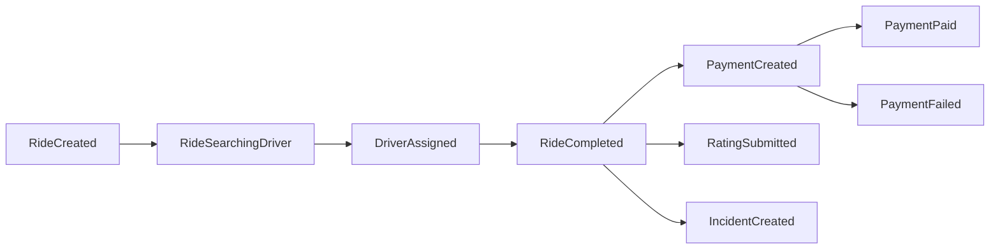

---

# 6. Ánh xạ Bounded Context → Microservice

Dựa trên API hiện có, đề xuất **8 Microservice chính**.

| Bounded Context | Microservice         | API chính            |
| --------------- | -------------------- | -------------------- |
| Identity        | `auth-service`       | `/auth/*`            |
| User            | `user-service`       | `/users/*`           |
| Driver          | `driver-service`     | `/drivers/*`         |
| Ride            | `ride-service`       | `/rides/*`           |
| Dispatch        | `dispatch-service`   | `/driver-requests/*` |
| Payment         | `payment-service`    | `/payments/*`        |
| Rating          | `rating-service`     | `/rides/{id}/rating` |
| Operations      | `operations-service` | `/operations/*`      |

### External Services

Không nên biến những thành phần sau thành Microservice nội bộ vì repo đang mô tả chúng là hệ thống bên ngoài:

```text
Map/Location Service
Payment Gateway
```

---

# 7. Mô tả Service

## 7.1. auth-service

### Trách nhiệm

* Register
* Login
* Xác thực JWT
* Phân quyền theo Role

### API

```text
POST /auth/register
POST /auth/login
```

### Role

```text
CUSTOMER
DRIVER
OPERATIONS
ADMIN
```

### Database

```text
auth_db
```

Đề xuất bảng:

```text
credentials
refresh_tokens
```

> Việc tách bảng `credentials` khỏi `users` là đề xuất kiến trúc; API hiện tại chỉ mô tả User chứ không công bố schema database thực tế.

---

# 7.2. user-service

### Trách nhiệm

Quản lý thông tin User:

```text
GET   /users/me
PATCH /users/me
```

### Database

```text
user_db
```

### Bảng

```text
users
```

```text
users
----------------
user_id PK
full_name
phone UK
role
status
created_at
updated_at
```

---

# 7.3. driver-service

### Trách nhiệm

* Driver profile
* Vehicle
* Availability
* Current location
* Driver rating summary

### API

```text
PUT   /drivers/me
PATCH /drivers/me/availability
```

### Database

```text
driver_db
```

### Mô hình

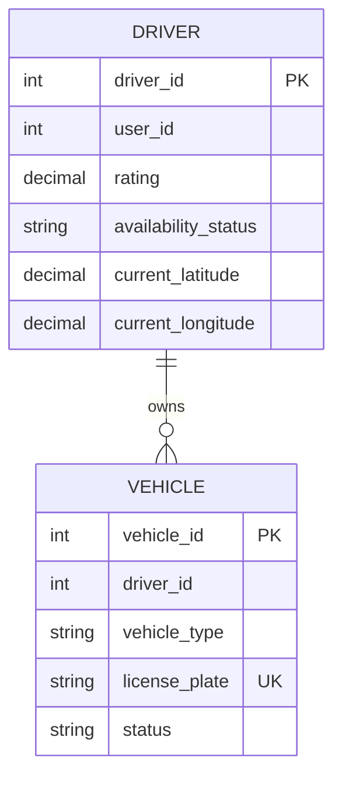

---

# 7.4. ride-service

Đây là service quản lý **vòng đời Ride**.

### API

```text
POST  /rides/estimate
POST  /rides
GET   /rides
GET   /rides/{ride_id}
PATCH /rides/{ride_id}/status
POST  /rides/{ride_id}/cancel
```

### Database

```text
ride_db
```

### Mô hình

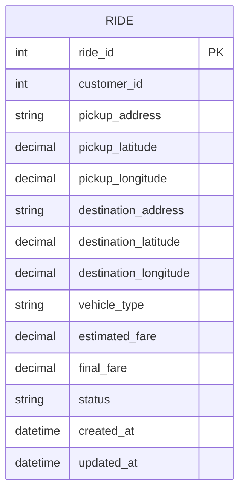

### Lưu ý

`ride-service` là **owner của Ride**, các service khác không được trực tiếp cập nhật bảng Ride.

---

# 7.5. dispatch-service

### Trách nhiệm

* Tìm Driver phù hợp
* Lọc theo khoảng cách
* Lọc theo loại xe
* Ưu tiên rating
* Gửi Driver Request
* Xử lý Accept/Decline/Expire

### API

```text
POST /rides/{ride_id}/driver-requests
POST /driver-requests/{request_id}/respond
```

### Database

```text
dispatch_db
```

### Mô hình

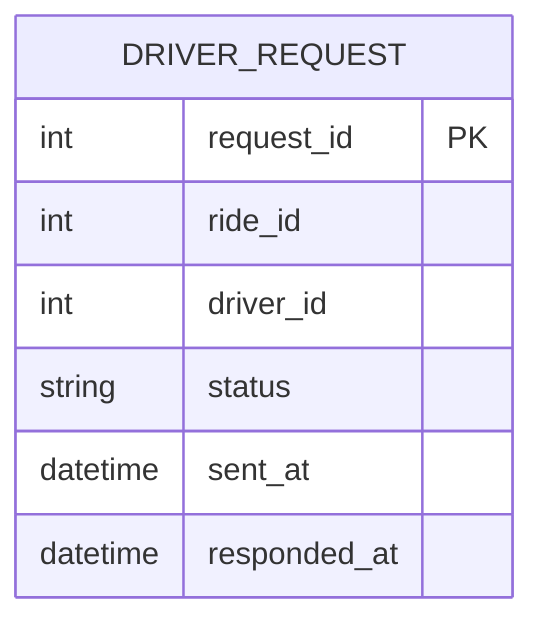

### Rule

```text
AVAILABLE Driver
      +
đúng Vehicle Type
      +
trong bán kính 5 km
      ↓
Candidate
      ↓
Driver Request
      ↓
30 seconds
      ↓
ACCEPTED / DECLINED / EXPIRED
```

---

# 7.6. payment-service

### Trách nhiệm

* Tạo Payment
* CASH
* ONLINE
* Cash confirmation
* Payment Gateway callback
* Idempotency

### API

```text
POST /rides/{ride_id}/payments
POST /payments/{payment_id}/cash-confirmation
POST /payments/callback
```

### Database

```text
payment_db
```

### Mô hình

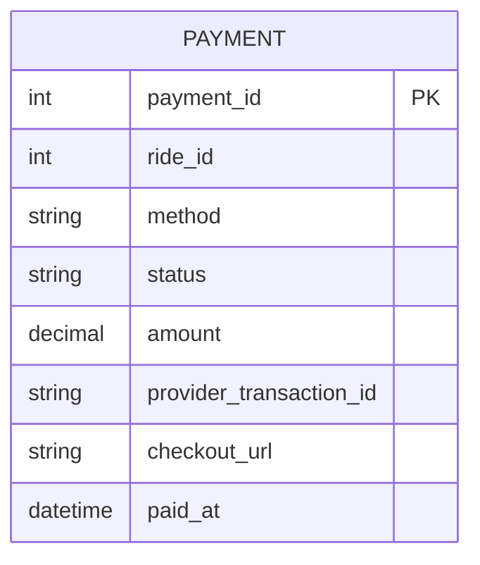

---

# 7.7. rating-service

### Trách nhiệm

* Tạo Rating
* Kiểm tra quyền Customer
* Kiểm tra Ride hoàn tất
* Kiểm tra Rating trùng
* Cập nhật điểm Driver

### API

```text
POST /rides/{ride_id}/rating
```

### Database

```text
rating_db
```

### Mô hình

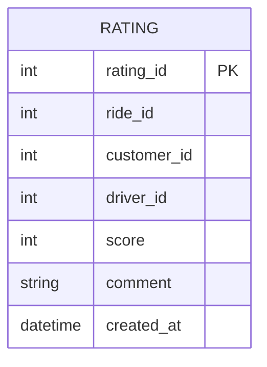

### Rule

```text
1 <= score <= 5
```

và:

```text
Một Ride → tối đa một Rating
```

---

# 7.8. operations-service

### Trách nhiệm

* Theo dõi Ride đang hoạt động
* Filter Ride theo status
* Ghi nhận Incident
* Hỗ trợ vận hành

### API

```text
GET  /operations/rides/active
POST /operations/incidents
```

### Database

```text
operations_db
```

### Mô hình đề xuất

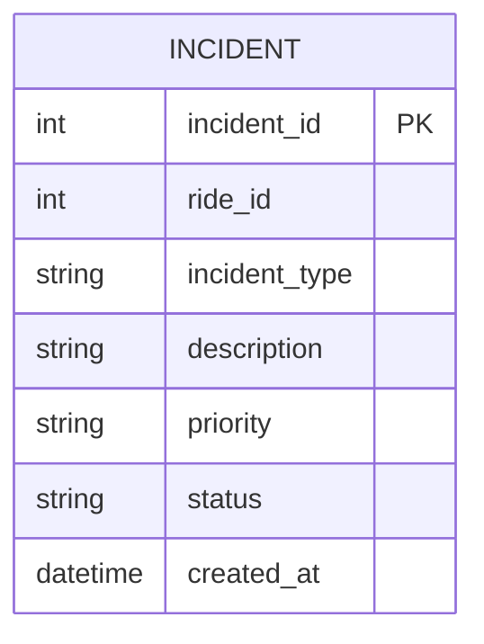

Các loại Incident được API/Test Case mô tả:

```text
SAFETY
PAYMENT
DRIVER
CUSTOMER
TECHNICAL
OTHER
```

---

# 8. Mô hình dữ liệu cho từng Service

## 8.1. Tổng quan Database per Service

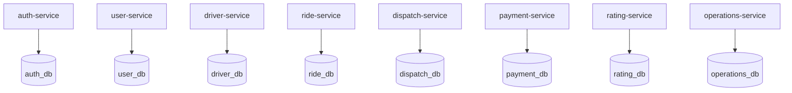

---

## 8.2. auth_db

```text
credentials
---------------------
credential_id PK
user_id
password_hash
created_at
updated_at

refresh_tokens
---------------------
token_id PK
user_id
token_hash
expires_at
revoked_at
```

---

## 8.3. user_db

```text
users
---------------------
user_id PK
full_name
phone UK
role
status
created_at
updated_at
```

---

## 8.4. driver_db

```text
drivers
---------------------
driver_id PK
user_id
rating
availability_status
current_latitude
current_longitude
created_at
updated_at
```

```text
vehicles
---------------------
vehicle_id PK
driver_id
vehicle_type
license_plate UK
status
```

---

## 8.5. ride_db

```text
rides
---------------------
ride_id PK
customer_id
pickup_address
pickup_latitude
pickup_longitude
destination_address
destination_latitude
destination_longitude
vehicle_type
estimated_fare
final_fare
status
created_at
updated_at
```

---

## 8.6. dispatch_db

```text
driver_requests
---------------------
request_id PK
ride_id
driver_id
status
sent_at
responded_at
```

---

## 8.7. payment_db

```text
payments
---------------------
payment_id PK
ride_id
method
status
amount
provider_transaction_id
checkout_url
paid_at
created_at
```

---

## 8.8. rating_db

```text
ratings
---------------------
rating_id PK
ride_id UK
customer_id
driver_id
score
comment
created_at
```

---

## 8.9. operations_db

```text
incidents
---------------------
incident_id PK
ride_id
incident_type
description
priority
status
created_at
updated_at
```

---

# 8.10. Nguyên tắc Database per Service

Mỗi Microservice sở hữu database riêng:

```text
auth-service       → auth_db
user-service       → user_db
driver-service     → driver_db
ride-service       → ride_db
dispatch-service   → dispatch_db
payment-service    → payment_db
rating-service     → rating_db
operations-service → operations_db
```

Không cho phép:

```text
payment-service → SELECT trực tiếp ride_db
rating-service  → UPDATE trực tiếp driver_db
dispatch-service → UPDATE trực tiếp ride_db
```

Thay vào đó, các service trao đổi qua:

```text
REST API
hoặc
Domain Event / Message Broker
```

---

# 9. Kiến trúc Microservice tổng thể

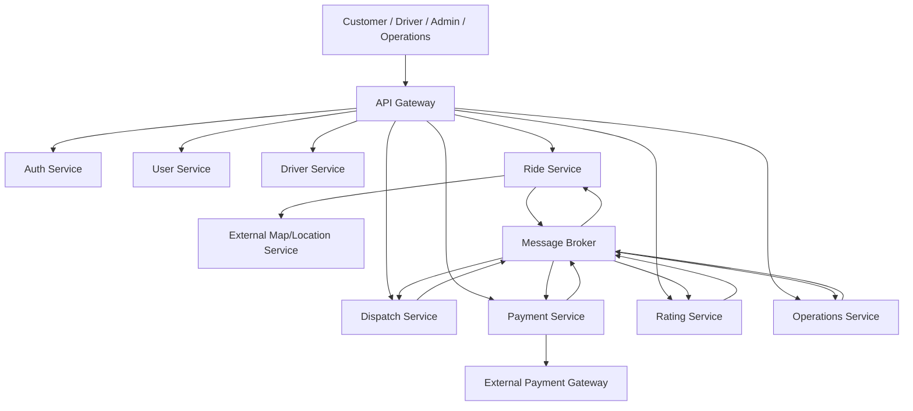

---

# 10. Luồng đặt xe hoàn chỉnh

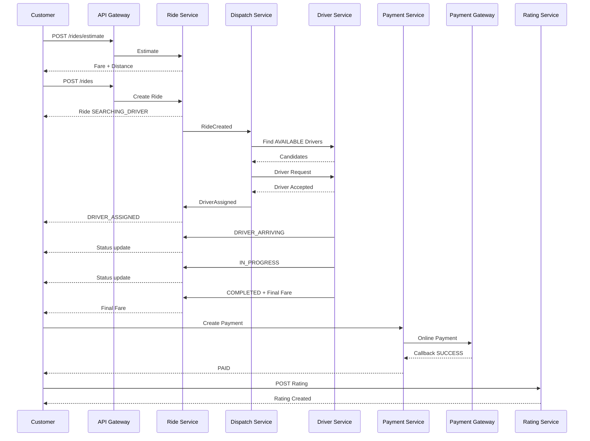

---

# 11. Kết luận kiến trúc

Từ chính các API và nghiệp vụ trong repository, kiến trúc Microservice đề xuất gồm:

```text
                    CAB SYSTEM
                        │
                  API Gateway
                        │
     ┌──────────────────┼───────────────────┐
     │                  │                   │
 Identity             Ride              Operations
     │                  │                   │
 ┌───┴───┐        ┌─────┴─────┐             │
 Auth   User      Dispatch   Driver          │
                     │                       │
                     └───────┬───────────────┘
                             │
                        Ride lifecycle
                             │
                    ┌────────┴────────┐
                    │                 │
                 Payment            Rating
                    │                 │
              Payment Gateway       Driver
```

### Các Microservice cuối cùng

| STT | Service              | Database        | Vai trò                     |
| --: | -------------------- | --------------- | --------------------------- |
|   1 | `auth-service`       | `auth_db`       | Authentication/JWT          |
|   2 | `user-service`       | `user_db`       | User profile                |
|   3 | `driver-service`     | `driver_db`     | Driver + Vehicle + Location |
|   4 | `ride-service`       | `ride_db`       | Vòng đời Ride               |
|   5 | `dispatch-service`   | `dispatch_db`   | Tìm và phân công Driver     |
|   6 | `payment-service`    | `payment_db`    | Thanh toán                  |
|   7 | `rating-service`     | `rating_db`     | Đánh giá Driver             |
|   8 | `operations-service` | `operations_db` | Giám sát và Incident        |

### Những thành phần giữ ở bên ngoài

```text
Map/Location Service
Payment Gateway
```

vì trong SRS chúng được xác định là **external actor/service**, không phải miền nghiệp vụ nội bộ của CAB SYSTEM.

### Điểm quan trọng

Thiết kế trên bám theo những gì repo hiện có:

* `/auth/*` → Authentication
* `/users/*` → User
* `/drivers/*` → Driver
* `/rides/*` → Ride
* `/driver-requests/*` → Dispatch
* `/payments/*` → Payment
* `/rides/{ride_id}/rating` → Rating
* `/operations/*` → Operations

Do repo không cung cấp implementation database/service thực tế mà chủ yếu cung cấp **SRS + API Specification + Test Case**, phần `database-per-service`, Event và một số bảng phụ ở trên được ghi nhận là **thiết kế Microservice đề xuất**, không khẳng định đó là database hiện đang chạy của repo.

