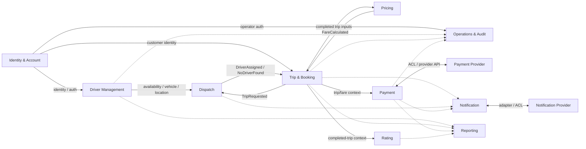
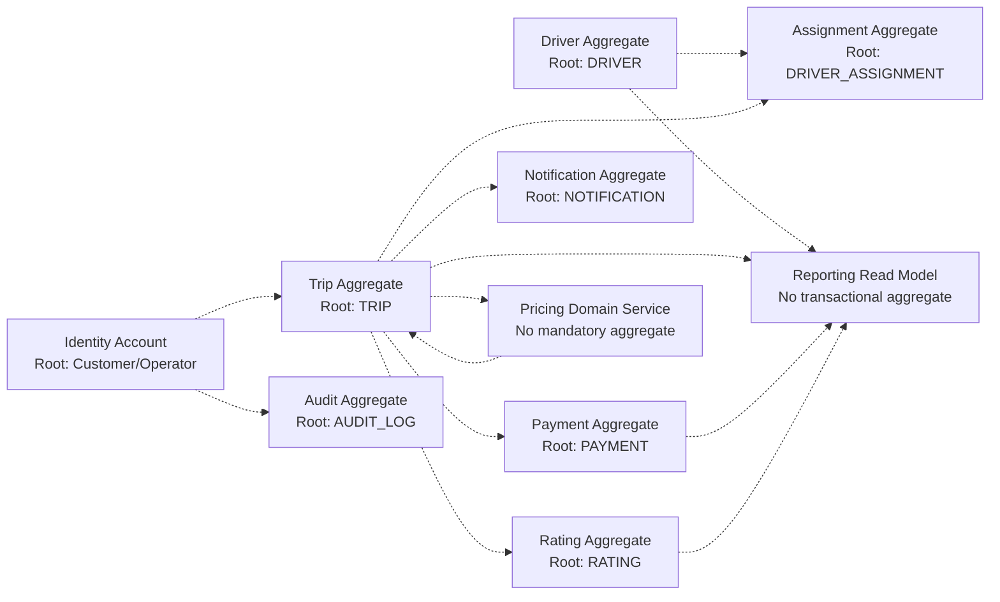
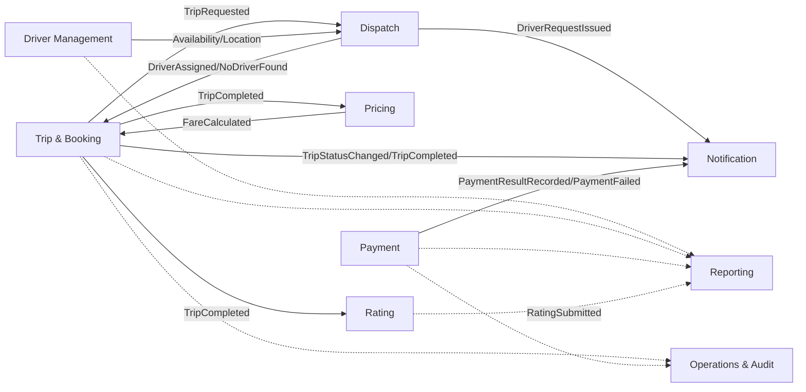
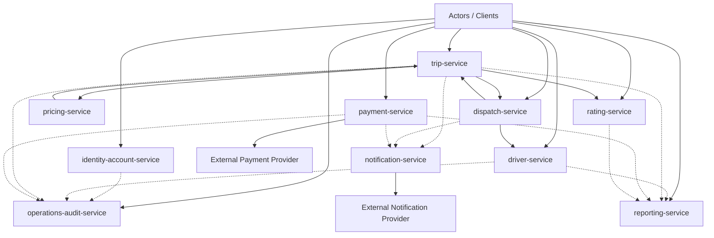

# CAB System — Microservice Design and Service Blueprint

## 1. Design Summary và Design Scope

[TECHNICAL DESIGN] The target remains **10 business-capability services**. Service boundaries are based on capability, consistency, change and failure boundaries—not on one entity/table per service.

[MICROSERVICE DESIGN] The uploaded DOCX states that decomposition should follow business responsibility and that contexts should coordinate through business communication rather than operate another context's internal logic. Phase 7 retains that principle. It does **not** retain the DOCX's 17-service split where it conflicts with the validated Phase 6 baseline.

### 1.1 Scope

In scope: bounded contexts, context map, ubiquitous language, aggregates/invariants, logical events, service contracts, database ownership, communication/failure boundaries, Mermaid flows, API/test reconciliation and implementation handoff.

Out of scope: source code, framework choice, broker choice, deployment manifests, invented SLA/retry values, and unresolved business policies.

## 2. Source Evidence và Classification

| Source | Role | Handling |
| --- | --- | --- |
| `07-final/srs.md` | Requirement source of truth | Highest authority |
| `CAB-SYSTEM-FINAL-RTM.md` / `06-FINAL-TRACEABILITY-MATRIX.md` | Canonical trace chain | Must remain intact |
| `07-final/api/*.yaml` | Final REST contract | 27 traced operations |
| `07-final/test-cases/*.md` | API-derived test basis | Must cover each operation |
| Final architecture + Phase 4 architecture files | Validated decomposition/data ownership/failure boundaries | Architecture baseline |
| `Micro-service.docx` | Supplemental design proposal | `[MICROSERVICE DESIGN]`; never silently overrides baseline |
| GitHub technical artifacts | Historical technical evidence | `[TECHNICAL DESIGN]`; implementation runtime still unverified |

Classification used: `[CUSTOMER REQUIREMENT]`, `[EXISTING SRS]`, `[MICROSERVICE DESIGN]`, `[INFERENCE]`, `[MBB DESIGN]`, `[TECHNICAL DESIGN]`, `[OPEN ISSUE]`.

### 2.1 DOCX reconciliation

| DOCX proposal | Phase 7 disposition | Reason | Classification |
| --- | --- | --- | --- |
| Decompose by business responsibility; contexts communicate via API/event | KEEP | Aligned with validated capability boundaries and no cross-DB access. | [MICROSERVICE DESIGN] + [TECHNICAL DESIGN] |
| Identity & Access -> `auth-service` | NORMALIZE | Use Phase 6 name `identity-account-service`; same capability. | [MICROSERVICE DESIGN] reconciled |
| Separate profile/vehicle/availability/location services | DO NOT KEEP | Phase 6 groups these into Identity/Driver capabilities; no entity-driven service split. | [MICROSERVICE DESIGN] conflict |
| Separate booking-service and trip-service | DO NOT KEEP | ENT04 is one request/lifecycle owner; split would create dual source of truth. | [MICROSERVICE DESIGN] conflict |
| Separate admin-service and audit-service | DO NOT KEEP | Phase 6 groups Operations & Audit; admin role/action details are still open. | [MICROSERVICE DESIGN] conflict |
| Separate trip-history-service | DO NOT KEEP | Trip owns history; Rating is separate rating-service. | [MICROSERVICE DESIGN] conflict |
| Booking contains PaymentMethod, PricingSnapshot, VoucherCode | PARTIAL REJECT | Final createRide baseline requires pickup/destination/vehicle type; Voucher is out of baseline. | [MICROSERVICE DESIGN] conflict |
| Pricing DB has base_fare, price_per_km/minute, discount | DO NOT BASELINE | Fare formula/data model is explicitly open; Pricing has no mandatory DB. | [MICROSERVICE DESIGN] conflict |
| Auth adds OTP/JWT/refresh token/forgot password/logout | DO NOT PROMOTE | Possible technical mechanisms only; not canonical FR/API requirements. | [MICROSERVICE DESIGN] conflict |
| DOCX UC-01…UC-32 | REMAP | Canonical source of truth is UC01–UC15; DOCX semantics differ. | [MICROSERVICE DESIGN] conflict |
| DOCX events booking.created/driver.assigned/trip.completed/payment.completed/rating.created | KEEP AS ALIASES ONLY | Remap to canonical UCs and Phase 7 logical event names; transport unspecified. | [MICROSERVICE DESIGN] reconciled |
| Database per Service | KEEP | Aligned with validated Phase 4/6 architecture. | [MICROSERVICE DESIGN] + [TECHNICAL DESIGN] |
| Reporting as read model | KEEP WITH NORMALIZATION | Derived/rebuildable projection; never writes source domains. | [MICROSERVICE DESIGN] + [TECHNICAL DESIGN] |

## 3. Bounded Context và Use Case Mapping

| Bounded Context | Business Capability | Actor | Canonical UC | Requirement source | Data | Service |
| --- | --- | --- | --- | --- | --- | --- |
| Identity & Account | Registration, login, customer/operator identity, authorization | Khách hàng; Tài xế(account); Quản trị viên/Operations | UC01, UC02(part), UC14 | BR02, BR03(part), BR16; FR01–03, FR08(part), FR41 | ENT01 CUSTOMER, ENT10 OPERATOR + credential/access technical storage | `identity-account-service` |
| Driver Management | Driver profile, vehicle, availability, location | Tài xế; Nhân viên vận hành | UC02(part), UC03, UC08 | BR03, BR07; FR08–10, FR19 | ENT02 DRIVER, ENT03 VEHICLE, ENT06 DRIVER_LOCATION | `driver-service` |
| Trip & Booking | Create ride request, lifecycle, tracking, history | Khách hàng; Tài xế | UC04, UC07, UC12(history) | BR01, BR06, BR12(part); FR04–07, FR17–24, FR34–35 | ENT04 TRIP | `trip-service` |
| Dispatch | Matching, driver request/response, replacement, no-driver | CAB System; Tài xế | UC05, UC06 | BR04, BR05; FR11–17 | ENT05 DRIVER_ASSIGNMENT | `dispatch-service` |
| Pricing | Final fare after completion | CAB System | UC09 | BR08; FR25 | No canonical entity; fare result returned to Trip | `pricing-service` |
| Payment | Cash/electronic payment and provider result | Khách hàng; Payment Provider | UC10 | BR09, BR10; FR26–30 | ENT07 PAYMENT | `payment-service` |
| Notification | Customer/driver lifecycle notification delivery | CAB System; Notification Provider | UC11 | BR11; FR31–33 | ENT08 NOTIFICATION | `notification-service` |
| Rating | Post-trip driver rating | Khách hàng | UC12(rating) | BR12; FR36 | ENT09 RATING | `rating-service` |
| Operations & Audit | Operational support/views and audit | Nhân viên vận hành; Quản trị viên | UC13, UC14 | BR13, BR14, BR16, BR17; FR37–42 | ENT11 AUDIT_LOG; ENT10 referenced from Identity | `operations-audit-service` |
| Reporting | Business activity reporting | Nhân viên vận hành; Ban lãnh đạo | UC15 | BR15; FR43 | Derived reporting projection only | `reporting-service` |

A UC may use several contexts, but each canonical state/data item has one write owner.

## 4. Business Capability Mapping

| Service | Capability | Requirement source | Provides API | Calls / dependencies | Events | Data ownership | Failure boundary |
| --- | --- | --- | --- | --- | --- | --- | --- |
| `identity-account-service` | Identity & Account | BR02, BR03(part), BR16; FR01–03, FR08(part), FR41; UC01/02/14 | `registerUser`, `loginUser`, `getCurrentUser`, `updateCurrentUser` | No mandatory business dependency; other services consume identity/authorization contract. | Publishes: AccountRegistered [TECHNICAL DESIGN] and auditable identity facts if required. Consumes: None mandatory. | identity_account_db — ENT01 CUSTOMER, ENT10 OPERATOR; credentials/access [TECHNICAL DESIGN] | Protected actions fail closed when identity/authorization is unavailable; login identifier remains OPEN ISSUE. |
| `driver-service` | Driver Management | BR03, BR07; FR08–10, FR19; UC02/03/08 | `updateDriverProfile`, `updateDriverAvailability`, `recordDriverLocation` | Identity reference/authorization only; no identity DB access. | Publishes: DriverAvailabilityChanged; DriverLocationUpdated [TECHNICAL DESIGN]. Consumes: Assignment outcome only if needed for operational state; BUSY semantics not promoted to business rule. | driver_db — ENT02 DRIVER, ENT03 VEHICLE, ENT06 DRIVER_LOCATION | Dispatch must not fabricate eligible drivers when Driver facts are unavailable. |
| `trip-service` | Trip & Booking | BR01, BR06, BR12(part), BR18(part); FR04–07, FR17–24, FR34–35, FR44(part); UC04/07/12 | `createRide`, `listCustomerRides`, `getRide`, `updateRideStatus` | Dispatch for matching outcome; Pricing for final fare; identity/authorization contract. | Publishes: TripRequested; TripStatusChanged; TripCompleted [TECHNICAL DESIGN]. Consumes: DriverAssigned; NoDriverFound; FareCalculated [TECHNICAL DESIGN]. | trip_db — ENT04 TRIP | Trip state remains authoritative; Payment/Notification failures do not roll back a valid completed Trip. |
| `dispatch-service` | Dispatch | BR04, BR05; FR11–17; UC05/06 | `sendDriverRequests`, `respondToDriverRequest` | Driver facts via API/projection; Trip request/reference. | Publishes: DriverRequestIssued; DriverResponseRecorded; DriverAssigned; NoDriverFound [TECHNICAL DESIGN]. Consumes: TripRequested plus driver availability/location facts [TECHNICAL DESIGN]. | dispatch_db — ENT05 DRIVER_ASSIGNMENT | Reject/non-response continues search; infrastructure outage must not be labeled NoDriverFound; numeric timeout/radius/ranking stay OPEN. |
| `pricing-service` | Pricing | BR08; FR25; UC09 | `calculateFinalFare` | Trip/service inputs through contract; never trip_db. | Publishes: FareCalculated [TECHNICAL DESIGN] if event handoff is chosen. Consumes: TripCompleted [TECHNICAL DESIGN] if asynchronous trigger is chosen. | No mandatory DB; no canonical entity until fare policy model approved | No fare is invented when policy/calculation is unavailable; fare formula remains OPEN. |
| `payment-service` | Payment | BR09, BR10; FR26–30; UC10; BR18/FR44(part) | `createPayment`, `paymentCallback`, `listPayments` | External Payment Provider; Trip/Pricing contract for amount/reference. | Publishes: PaymentResultRecorded; PaymentFailed [TECHNICAL DESIGN]. Consumes: Trip/fare facts as needed [TECHNICAL DESIGN]. | payment_db — ENT07 PAYMENT | Payment failure is isolated from Trip; sensitive payment credentials are not stored; retry policy remains OPEN. |
| `notification-service` | Notification | BR11; FR31–33; UC11; BR18/FR44(part); NFR03/NFR13 | `createNotification` | External notification provider/channel adapter only. | Publishes: NotificationDeliveryResult [TECHNICAL DESIGN]. Consumes: Trip/Dispatch/Payment lifecycle facts [TECHNICAL DESIGN]. | notification_db — ENT08 NOTIFICATION | Delivery failure is recorded here and never rolls back Trip/Payment; retry/fallback remains OPEN. |
| `rating-service` | Rating | BR12; FR36; UC12 | `rateDriver` | Trip contract/projection to validate completed-trip context if needed. | Publishes: RatingSubmitted [TECHNICAL DESIGN]. Consumes: Completed-trip fact/projection if used [TECHNICAL DESIGN]. | rating_db — ENT09 RATING | Rating failure does not affect completed Trip/Payment; scale/cardinality remain MBB/open. |
| `operations-audit-service` | Operations & Audit | BR13, BR14, BR17; FR37–40, FR42; UC13/14; BR16/FR41 authorization | `listActiveRides`, `listOperationsCustomers`, `listOperationsDrivers`, `listOperationsVehicles`, `listOperationsRides`, `getRideSupportContext`, `listAuditLogs` | Identity, Driver, Trip, Payment contracts; never their databases. | Publishes: AuditActionRecorded [TECHNICAL DESIGN] where an audit fact must be shared. Consumes: Important-action facts/events [TECHNICAL DESIGN]. | operations_audit_db — ENT11 AUDIT_LOG | Operations may degrade without corrupting core transactions; sensitive admin action fails closed on authorization uncertainty. |
| `reporting-service` | Reporting | BR15; FR43; UC15 | `getActivityReport` | Consume Trip/Payment/Driver/Rating facts via API/events; no direct source DB joins. | Publishes: None required. Consumes: Reporting facts [TECHNICAL DESIGN]. | optional reporting_read_db [TECHNICAL DESIGN] — derived/rebuildable projection | Reporting outage must not block booking/trip/payment; metric definitions beyond named business metrics remain OPEN. |

## 5. Ubiquitous Language

[MICROSERVICE DESIGN] The DOCX contributes terms such as Booking, Driver, Vehicle, Availability, Assignment, Trip, Fare, Payment, Notification, Rating, Audit Log and Report. Phase 7 keeps only meanings consistent with the canonical baseline.

| Term | Context | Meaning | Boundary note |
| --- | --- | --- | --- |
| Account | Identity & Account | Customer/operator account identity; credential mechanism is technical. | Not Customer Profile or Driver Profile. |
| Customer | Identity & Account | Ride-booking customer identity/profile owned by ENT01. | Other contexts use ID/contract. |
| Operator | Identity & Account | Authorized operations/admin identity owned by ENT10. | Audit keeps operator reference only. |
| Driver | Driver Management | Driver profile participating in ride service. | Account identity is separate. |
| Vehicle | Driver Management | Vehicle data associated with Driver. | Not a standalone service. |
| Availability | Driver Management | Driver readiness/activity used by matching. | Not Trip status. |
| Driver Location | Driver Management | Recorded location/time used for matching/ETA. | Retention/offline policy remains open. |
| Booking / Ride Request | Trip & Booking | Customer request with pickup, destination, requested vehicle type. | Implemented within Trip aggregate/service. |
| Trip | Trip & Booking | Canonical lifecycle record from request through completion/history. | Not Dispatch Assignment or Payment. |
| Driver Assignment | Dispatch | A driver request/response attempt and selected outcome. | Owned by ENT05. |
| No Driver | Dispatch | Business outcome: no suitable driver under approved criteria. | Never used for infrastructure outage. |
| Fare | Pricing / Trip & Booking | Final amount after completed trip under approved fare policy. | Pre-trip estimate/formula are not baseline. |
| Payment | Payment | Cash/electronic payment transaction for trip amount. | Does not own Trip completion. |
| Notification | Notification | Delivery request/status for lifecycle message. | Does not own Trip/Payment state. |
| Rating | Rating | Post-trip feedback on driver. | Scale/one-per-trip not customer-confirmed. |
| Audit Log | Operations & Audit | Trace of important action. | Exact catalog/retention open. |
| Report | Reporting | Derived business view for required metrics. | Not source-of-truth transaction data. |

## 6. Context Map

[TECHNICAL DESIGN] Final OpenAPI is the REST Published Language. Logical events may be used for decoupled facts/side effects/read models. No broker technology or delivery guarantee is selected.

| Upstream | Downstream | Published Language / Data | Interaction | Boundary/ACL |
| --- | --- | --- | --- | --- |
| Identity & Account | Driver Management | identity/account ref, authorization | REST/auth contract; event optional | Driver owns profile; no identity DB access |
| Identity & Account | Trip & Booking | customer identity / authorization | REST/auth context | Trip stores customer_id only |
| Identity & Account | Operations & Audit | operator identity / authorization | REST/auth context | Sensitive action fails closed |
| Driver Management | Dispatch | availability, vehicle, location | REST query or event-fed projection | Dispatch never queries driver_db |
| Trip & Booking | Dispatch | valid trip request/matching inputs | TripRequested event or internal command | Dispatch owns assignment; Trip owns lifecycle |
| Dispatch | Trip & Booking | assigned/no-driver outcome | DriverAssigned / NoDriverFound | Infra outage is not NoDriverFound |
| Trip & Booking | Pricing | completed trip/service inputs | internal REST or event/reply | No direct trip_db access; fare formula open |
| Pricing | Trip & Booking / Payment | final fare result | REST response or FareCalculated | Trip keeps authoritative fare field |
| Trip/Dispatch/Payment | Notification | lifecycle/payment facts | logical events or POST /notifications | Notification failure isolated |
| Payment | External Payment Provider | payment request/result | provider API + callback via ACL | Provider vocabulary translated inside Payment |
| Notification | External Notification Provider | delivery request/result | provider adapter/ACL | Provider/channel vocabulary stays outside core |
| Trip & Booking | Rating | completed-trip context | REST validation or projection | Rating owns feedback |
| Identity/Driver/Trip/Payment | Operations & Audit | ops/support data, audit facts | REST query + logical event | No direct source DB access |
| Trip/Payment/Driver/Rating | Reporting | report facts | event or query API | Derived projection only |

### 6.1 Mermaid Context Map

### 6.2 Published Language / ACL

- REST Published Language = final OpenAPI schemas + canonical IDs.
- Event Published Language = logical event name + minimum business payload defined in §8.
- Payment Provider and Notification Provider are isolated behind adapters/ACL so provider-specific vocabulary does not leak into core contexts.
- Cross-service IDs are opaque references, never cross-database physical FKs.

## 7. Aggregate và Business Invariant

[MICROSERVICE DESIGN] The DOCX proposes Booking, Trip and Payment aggregates. Phase 7 keeps aggregate-oriented modeling but reconciles it: Booking is part of the **Trip aggregate**; VoucherCode and unapproved pre-trip pricing/payment fields are excluded.

| Aggregate | Root | Main components | Owner | Invariant | Trace | Classification |
| --- | --- | --- | --- | --- | --- | --- |
| Identity Account Aggregate | Customer/Operator identity | ENT01/ENT10 + credential/access technical data | `identity-account-service` | Account-required/protected actions require valid identity/authorization; credential secrets are not business payload. | BR02, BR16; FR02, FR41; UC01, UC14; AC01, AC14, AC18 | [INFERENCE] + [TECHNICAL DESIGN] |
| Driver Aggregate | DRIVER | ENT02 DRIVER, ENT03 VEHICLE, availability, ENT06 location | `driver-service` | Matching considers approved readiness/eligibility facts; profile/vehicle/location remain Driver-owned. | BR03, BR04, BR07; FR09–11, FR19; UC02/03/05/08; AC02/03/05/08 | [INFERENCE] |
| Trip Aggregate | TRIP | ENT04: customer ref, pickup, destination, vehicle type, assignment ref, lifecycle, fare/history facts | `trip-service` | Ride request requires pickup/destination/vehicle type; invalid lifecycle update is rejected; completed Trip is not rolled back by Payment/Notification failure. | BR01, BR06, BR10; FR04–07, FR17–24, FR34–35; UC04/07/12; AC04/07/12/18 | [EXISTING SRS] + [INFERENCE] |
| Driver Assignment Aggregate | DRIVER_ASSIGNMENT | ENT05: trip ref, driver ref, request/response facts, selected result | `dispatch-service` | Accept records assignment; reject/non-response continues search without customer rebooking; no numeric timeout is invariant. | BR04, BR05; FR11–17; UC05/06; AC05/06/18 | [CUSTOMER REQUIREMENT] + [INFERENCE] |
| Payment Aggregate | PAYMENT | ENT07: trip ref, method, amount, status, provider ref | `payment-service` | Record payment result without storing sensitive card/account data; failed electronic payment does not invalidate completed Trip. | BR09, BR10; FR26–30; UC10; AC10/16/18 | [CUSTOMER REQUIREMENT] + [INFERENCE] |
| Notification Aggregate | NOTIFICATION | ENT08: recipient/trip refs, type, delivery status | `notification-service` | Notification owns delivery status; delivery failure cannot roll back source business state. | BR11; FR31–33; UC11; AC11/18; NFR03 | [CUSTOMER REQUIREMENT] + [INFERENCE] |
| Rating Aggregate | RATING | ENT09: trip/customer/driver refs, score/comment/time | `rating-service` | Rating is post-trip; score range and one-rating-per-trip remain MBB/open. | BR12; FR36; UC12; AC12/18 | [CUSTOMER REQUIREMENT] + [MBB DESIGN boundary] |
| Audit Aggregate | AUDIT_LOG | ENT11: actor/action/target/detail/time | `operations-audit-service` | Important authorized actions are traceable; exact catalog/retention not invented. | BR16, BR17; FR41–42; UC14; AC14/18 | [CUSTOMER REQUIREMENT] + [INFERENCE] |

Pricing is currently a domain service with no mandatory aggregate/database. Reporting is a derived read-model boundary, not a transactional aggregate.

### 7.1 Aggregate Map

## 8. Domain Event và Event Flow

[MICROSERVICE DESIGN] DOCX events (`user.registered`, `booking.created`, `driver.assigned`, `trip.completed`, `payment.completed`, `rating.created`) are treated only as aliases where compatible. Canonical UC traces and Phase 7 logical event names below govern implementation.

| Event | UC | Producer Context | Consumer Context | Purpose | Minimum payload | Emit condition | Classification |
| --- | --- | --- | --- | --- | --- | --- | --- |
| `AccountRegistered` | UC01/UC02 | Identity & Account | Driver Management / Operations & Audit | Non-secret identity reference/audit fact | account/customer/driver ref, actor type, occurred_at | After valid registration | [TECHNICAL DESIGN]; DOCX `user.registered` = [MICROSERVICE DESIGN] alias |
| `DriverAvailabilityChanged` | UC03 | Driver Management | Dispatch / Reporting | Keep eligibility projection current | driver_id, availability, occurred_at | After readiness update | [TECHNICAL DESIGN] |
| `DriverLocationUpdated` | UC08 | Driver Management | Dispatch / Trip | Provide location fact for matching/ETA | driver_id, location, recorded_at | After location stored | [TECHNICAL DESIGN] |
| `TripRequested` | UC04 | Trip & Booking | Dispatch / Notification | Start matching / booking-received side effect | trip_id, pickup, destination, requested_vehicle_type | After valid ride created | [TECHNICAL DESIGN]; DOCX `booking.created` alias |
| `DriverRequestIssued` | UC05 | Dispatch | Notification | Notify candidate driver | request_id, trip_id, driver_id | After request issued | [TECHNICAL DESIGN] |
| `DriverResponseRecorded` | UC06 | Dispatch | Trip & Booking / Reporting | Expose accept/decline result | request_id, trip_id, driver_id, response | After response recorded | [TECHNICAL DESIGN] |
| `DriverAssigned` | UC06 | Dispatch | Trip & Booking / Notification / Operations & Audit | Commit accepted driver outcome | trip_id, driver_id, assignment_id | After valid acceptance | [TECHNICAL DESIGN]; DOCX `driver.assigned` alias |
| `NoDriverFound` | UC05 | Dispatch | Trip & Booking / Notification | Represent confirmed no-driver business outcome | trip_id | After no suitable driver remains under approved criteria | [TECHNICAL DESIGN] event carrying [CUSTOMER REQUIREMENT] outcome |
| `TripStatusChanged` | UC07 | Trip & Booking | Notification / Operations & Audit / Reporting | Publish lifecycle change | trip_id, status, occurred_at | After valid status change | [TECHNICAL DESIGN]; replaces DOCX standalone `trip.started` |
| `TripCompleted` | UC07 | Trip & Booking | Pricing / Notification / Rating / Reporting | Trigger post-trip capabilities | trip_id, customer_id, driver_id, required trip facts | After COMPLETED | [TECHNICAL DESIGN]; DOCX `trip.completed` alias |
| `FareCalculated` | UC09 | Pricing | Trip & Booking / Payment | Return final fare result | trip_id, fare_amount | After approved policy calculates fare | [TECHNICAL DESIGN] |
| `PaymentResultRecorded` | UC10 | Payment | Notification / Reporting / Operations & Audit | Expose payment outcome | payment_id, trip_id, status, amount | After payment result stored | [TECHNICAL DESIGN]; DOCX `payment.completed` maps only to success |
| `PaymentFailed` | UC10 | Payment | Notification / Operations & Audit | Expose failed payment | payment_id, trip_id, failed status | After failed electronic result | [TECHNICAL DESIGN] |
| `NotificationDeliveryResult` | UC11 | Notification | Operations & Audit if needed | Expose delivery status | notification_id, recipient_ref, delivery_status | After provider attempt result | [TECHNICAL DESIGN] |
| `RatingSubmitted` | UC12 | Rating | Reporting if needed | Feed reporting projection | rating_id, trip_id, driver_id | After valid rating stored | [TECHNICAL DESIGN]; DOCX `rating.created` alias |
| `AuditActionRecorded` | UC14 | Operations & Audit | None required | Explicit audit fact | audit_id, actor_ref, action, target_ref, occurred_at | After auditable action stored | [TECHNICAL DESIGN] |

All event names are `[TECHNICAL DESIGN]`; event transport, retry, ordering and DLQ semantics remain implementation decisions.

### 8.1 Domain Event Flow

## 9. Context-to-Microservice Mapping

| Context | Service | Phase 7 decision | DOCX reconciliation |
| --- | --- | --- | --- |
| Identity & Account | `identity-account-service` | Keep | Normalize DOCX `auth-service`; no separate profile-service |
| Driver Management | `driver-service` | Keep | Consolidate DOCX Driver/Vehicle/Availability/Location services |
| Trip & Booking | `trip-service` | Keep | Merge DOCX booking-service + trip-service |
| Dispatch | `dispatch-service` | Keep | Driver Dispatch retained |
| Pricing | `pricing-service` | Keep | No fixed pricing schema/DB until fare policy approved |
| Payment | `payment-service` | Keep | Retained |
| Notification | `notification-service` | Keep | Retained |
| Rating | `rating-service` | Keep | Trip history stays Trip-owned; Rating stays separate |
| Operations & Audit | `operations-audit-service` | Keep | Consolidate DOCX Operations/Admin/Audit |
| Reporting | `reporting-service` | Keep | Read-model boundary retained |

### 9.1 Service Map

## 10. Service Responsibilities và Service Boundaries

### 10.1 `identity-account-service` — Identity & Account

- **Purpose / boundary:** Own account identity, authentication boundary and authorization decisions.
- **Requirement source:** BR02, BR03(part), BR16; FR01–03, FR08(part), FR41; UC01/02/14
- **Provides API:** `registerUser`, `loginUser`, `getCurrentUser`, `updateCurrentUser`.
- **Calls / dependencies:** No mandatory business dependency; other services consume identity/authorization contract.
- **Publishes:** AccountRegistered [TECHNICAL DESIGN] and auditable identity facts if required.
- **Consumes:** None mandatory.
- **Owned data / DB:** identity_account_db — ENT01 CUSTOMER, ENT10 OPERATOR; credentials/access [TECHNICAL DESIGN]
- **Failure boundary:** Protected actions fail closed when identity/authorization is unavailable; login identifier remains OPEN ISSUE.

### 10.2 `driver-service` — Driver Management

- **Purpose / boundary:** Own driver profile, vehicle, availability and location.
- **Requirement source:** BR03, BR07; FR08–10, FR19; UC02/03/08
- **Provides API:** `updateDriverProfile`, `updateDriverAvailability`, `recordDriverLocation`.
- **Calls / dependencies:** Identity reference/authorization only; no identity DB access.
- **Publishes:** DriverAvailabilityChanged; DriverLocationUpdated [TECHNICAL DESIGN].
- **Consumes:** Assignment outcome only if needed for operational state; BUSY semantics not promoted to business rule.
- **Owned data / DB:** driver_db — ENT02 DRIVER, ENT03 VEHICLE, ENT06 DRIVER_LOCATION
- **Failure boundary:** Dispatch must not fabricate eligible drivers when Driver facts are unavailable.

### 10.3 `trip-service` — Trip & Booking

- **Purpose / boundary:** Own booking request plus canonical trip lifecycle/history in one consistency boundary.
- **Requirement source:** BR01, BR06, BR12(part), BR18(part); FR04–07, FR17–24, FR34–35, FR44(part); UC04/07/12
- **Provides API:** `createRide`, `listCustomerRides`, `getRide`, `updateRideStatus`.
- **Calls / dependencies:** Dispatch for matching outcome; Pricing for final fare; identity/authorization contract.
- **Publishes:** TripRequested; TripStatusChanged; TripCompleted [TECHNICAL DESIGN].
- **Consumes:** DriverAssigned; NoDriverFound; FareCalculated [TECHNICAL DESIGN].
- **Owned data / DB:** trip_db — ENT04 TRIP
- **Failure boundary:** Trip state remains authoritative; Payment/Notification failures do not roll back a valid completed Trip.

### 10.4 `dispatch-service` — Dispatch

- **Purpose / boundary:** Own matching/request-response loop and assignment attempts.
- **Requirement source:** BR04, BR05; FR11–17; UC05/06
- **Provides API:** `sendDriverRequests`, `respondToDriverRequest`.
- **Calls / dependencies:** Driver facts via API/projection; Trip request/reference.
- **Publishes:** DriverRequestIssued; DriverResponseRecorded; DriverAssigned; NoDriverFound [TECHNICAL DESIGN].
- **Consumes:** TripRequested plus driver availability/location facts [TECHNICAL DESIGN].
- **Owned data / DB:** dispatch_db — ENT05 DRIVER_ASSIGNMENT
- **Failure boundary:** Reject/non-response continues search; infrastructure outage must not be labeled NoDriverFound; numeric timeout/radius/ranking stay OPEN.

### 10.5 `pricing-service` — Pricing

- **Purpose / boundary:** Calculate final fare after trip completion without moving fare policy into Trip.
- **Requirement source:** BR08; FR25; UC09
- **Provides API:** `calculateFinalFare`.
- **Calls / dependencies:** Trip/service inputs through contract; never trip_db.
- **Publishes:** FareCalculated [TECHNICAL DESIGN] if event handoff is chosen.
- **Consumes:** TripCompleted [TECHNICAL DESIGN] if asynchronous trigger is chosen.
- **Owned data / DB:** No mandatory DB; no canonical entity until fare policy model approved
- **Failure boundary:** No fare is invented when policy/calculation is unavailable; fare formula remains OPEN.

### 10.6 `payment-service` — Payment

- **Purpose / boundary:** Own cash/electronic payment records and provider results.
- **Requirement source:** BR09, BR10; FR26–30; UC10; BR18/FR44(part)
- **Provides API:** `createPayment`, `paymentCallback`, `listPayments`.
- **Calls / dependencies:** External Payment Provider; Trip/Pricing contract for amount/reference.
- **Publishes:** PaymentResultRecorded; PaymentFailed [TECHNICAL DESIGN].
- **Consumes:** Trip/fare facts as needed [TECHNICAL DESIGN].
- **Owned data / DB:** payment_db — ENT07 PAYMENT
- **Failure boundary:** Payment failure is isolated from Trip; sensitive payment credentials are not stored; retry policy remains OPEN.

### 10.7 `notification-service` — Notification

- **Purpose / boundary:** Own notification delivery request/status and isolate provider/channel failure.
- **Requirement source:** BR11; FR31–33; UC11; BR18/FR44(part); NFR03/NFR13
- **Provides API:** `createNotification`.
- **Calls / dependencies:** External notification provider/channel adapter only.
- **Publishes:** NotificationDeliveryResult [TECHNICAL DESIGN].
- **Consumes:** Trip/Dispatch/Payment lifecycle facts [TECHNICAL DESIGN].
- **Owned data / DB:** notification_db — ENT08 NOTIFICATION
- **Failure boundary:** Delivery failure is recorded here and never rolls back Trip/Payment; retry/fallback remains OPEN.

### 10.8 `rating-service` — Rating

- **Purpose / boundary:** Own post-trip driver feedback.
- **Requirement source:** BR12; FR36; UC12
- **Provides API:** `rateDriver`.
- **Calls / dependencies:** Trip contract/projection to validate completed-trip context if needed.
- **Publishes:** RatingSubmitted [TECHNICAL DESIGN].
- **Consumes:** Completed-trip fact/projection if used [TECHNICAL DESIGN].
- **Owned data / DB:** rating_db — ENT09 RATING
- **Failure boundary:** Rating failure does not affect completed Trip/Payment; scale/cardinality remain MBB/open.

### 10.9 `operations-audit-service` — Operations & Audit

- **Purpose / boundary:** Provide operations support/views and own audit trail without owning source transaction data.
- **Requirement source:** BR13, BR14, BR17; FR37–40, FR42; UC13/14; BR16/FR41 authorization
- **Provides API:** `listActiveRides`, `listOperationsCustomers`, `listOperationsDrivers`, `listOperationsVehicles`, `listOperationsRides`, `getRideSupportContext`, `listAuditLogs`.
- **Calls / dependencies:** Identity, Driver, Trip, Payment contracts; never their databases.
- **Publishes:** AuditActionRecorded [TECHNICAL DESIGN] where an audit fact must be shared.
- **Consumes:** Important-action facts/events [TECHNICAL DESIGN].
- **Owned data / DB:** operations_audit_db — ENT11 AUDIT_LOG
- **Failure boundary:** Operations may degrade without corrupting core transactions; sensitive admin action fails closed on authorization uncertainty.

### 10.10 `reporting-service` — Reporting

- **Purpose / boundary:** Serve required business reports from derived/rebuildable projections.
- **Requirement source:** BR15; FR43; UC15
- **Provides API:** `getActivityReport`.
- **Calls / dependencies:** Consume Trip/Payment/Driver/Rating facts via API/events; no direct source DB joins.
- **Publishes:** None required.
- **Consumes:** Reporting facts [TECHNICAL DESIGN].
- **Owned data / DB:** optional reporting_read_db [TECHNICAL DESIGN] — derived/rebuildable projection
- **Failure boundary:** Reporting outage must not block booking/trip/payment; metric definitions beyond named business metrics remain OPEN.

## 11. API-to-Service Mapping

Every final REST operation has `x-service` and `x-trace` (`UC`, `FR`, `BR`) and a matching testcase group.

| YAML | operationId | Method / Path | Context | Service | UC | FR | BR |
| --- | --- | --- | --- | --- | --- | --- | --- |
| `driver-requests.yaml` | `respondToDriverRequest` | `POST /driver-requests/{request_id}/respond` | Dispatch | `dispatch-service` | UC06 | FR14, FR15, FR17 | BR05, BR06 |
| `driver-requests.yaml` | `sendDriverRequests` | `POST /rides/{ride_id}/driver-requests` | Dispatch | `dispatch-service` | UC05 | FR11, FR12, FR13, FR15, FR16 | BR04, BR05, BR11 |
| `drivers.yaml` | `updateDriverProfile` | `PUT /drivers/me` | Driver Management | `driver-service` | UC02 | FR09 | BR03 |
| `drivers.yaml` | `updateDriverAvailability` | `PATCH /drivers/me/availability` | Driver Management | `driver-service` | UC03 | FR10 | BR03, BR04 |
| `drivers.yaml` | `recordDriverLocation` | `POST /drivers/me/locations` | Driver Management | `driver-service` | UC08 | FR19 | BR07 |
| `authentication.yaml` | `loginUser` | `POST /auth/login` | Identity & Account | `identity-account-service` | UC01 | FR02 | BR02, BR16 |
| `authentication.yaml` | `registerUser` | `POST /auth/register` | Identity & Account | `identity-account-service` | UC01, UC02 | FR01, FR08 | BR02, BR03 |
| `users.yaml` | `getCurrentUser` | `GET /users/me` | Identity & Account | `identity-account-service` | UC01 | FR03 | BR02 |
| `users.yaml` | `updateCurrentUser` | `PATCH /users/me` | Identity & Account | `identity-account-service` | UC01 | FR03 | BR02 |
| `notifications.yaml` | `createNotification` | `POST /notifications` | Notification | `notification-service` | UC11 | FR31, FR32, FR33 | BR10, BR11 |
| `operations.yaml` | `listAuditLogs` | `GET /operations/audit-logs` | Operations & Audit | `operations-audit-service` | UC14 | FR42 | BR17 |
| `operations.yaml` | `listOperationsCustomers` | `GET /operations/customers` | Operations & Audit | `operations-audit-service` | UC13 | FR37 | BR13 |
| `operations.yaml` | `listOperationsDrivers` | `GET /operations/drivers` | Operations & Audit | `operations-audit-service` | UC13 | FR37 | BR13 |
| `operations.yaml` | `listOperationsRides` | `GET /operations/rides` | Operations & Audit | `operations-audit-service` | UC13 | FR37 | BR13 |
| `operations.yaml` | `listActiveRides` | `GET /operations/rides/active` | Operations & Audit | `operations-audit-service` | UC13 | FR38 | BR13 |
| `operations.yaml` | `getRideSupportContext` | `GET /operations/rides/{ride_id}/support-context` | Operations & Audit | `operations-audit-service` | UC13 | FR40 | BR14 |
| `operations.yaml` | `listOperationsVehicles` | `GET /operations/vehicles` | Operations & Audit | `operations-audit-service` | UC13 | FR37 | BR13 |
| `payments.yaml` | `listPayments` | `GET /payments` | Payment | `payment-service` | UC13 | FR39 | BR13 |
| `payments.yaml` | `paymentCallback` | `POST /payments/callback` | Payment | `payment-service` | UC10 | FR27, FR28, FR29, FR30 | BR09, BR10 |
| `payments.yaml` | `createPayment` | `POST /rides/{ride_id}/payments` | Payment | `payment-service` | UC10 | FR26, FR27, FR28, FR29 | BR09, BR10 |
| `pricing.yaml` | `calculateFinalFare` | `POST /pricing/rides/{ride_id}/final-fare` | Pricing | `pricing-service` | UC09 | FR25 | BR08 |
| `ratings.yaml` | `rateDriver` | `POST /rides/{ride_id}/rating` | Rating | `rating-service` | UC12 | FR36 | BR12 |
| `reporting.yaml` | `getActivityReport` | `GET /reports/activity` | Reporting | `reporting-service` | UC15 | FR43 | BR15 |
| `rides.yaml` | `createRide` | `POST /rides` | Trip & Booking | `trip-service` | UC04 | FR04, FR05, FR06, FR07 | BR01, BR06, BR11 |
| `rides.yaml` | `listCustomerRides` | `GET /rides` | Trip & Booking | `trip-service` | UC12 | FR34, FR35 | BR10, BR12 |
| `rides.yaml` | `getRide` | `GET /rides/{ride_id}` | Trip & Booking | `trip-service` | UC07 | FR18, FR24 | BR06, BR07 |
| `rides.yaml` | `updateRideStatus` | `PATCH /rides/{ride_id}/status` | Trip & Booking | `trip-service` | UC07 | FR20, FR21, FR22, FR23 | BR06, BR11 |

### 11.1 Historical APIs intentionally excluded from final baseline

- `POST /rides/estimate`: no canonical FR/UC for pre-trip estimate.
- `POST /rides/{ride_id}/cancel`: cancellation policy is open.
- `POST /payments/{payment_id}/cash-confirmation`: assigned-driver confirmation rule lacks approved FR/UC.
- Historical `POST /operations/incidents`: incident taxonomy/entity not approved; final baseline uses support-context query.

## 12. Database per Service và Data Ownership

[TECHNICAL DESIGN] Database per Service is an **ownership rule**, not a mandate to create a physical database for a stateless capability.

| Service | Logical DB / owned data | Direct access by other service |
| --- | --- | --- |
| `identity-account-service` | identity_account_db — ENT01 CUSTOMER, ENT10 OPERATOR; credentials/access [TECHNICAL DESIGN] | FORBIDDEN |
| `driver-service` | driver_db — ENT02 DRIVER, ENT03 VEHICLE, ENT06 DRIVER_LOCATION | FORBIDDEN |
| `trip-service` | trip_db — ENT04 TRIP | FORBIDDEN |
| `dispatch-service` | dispatch_db — ENT05 DRIVER_ASSIGNMENT | FORBIDDEN |
| `pricing-service` | No mandatory DB; no canonical entity until fare policy model approved | FORBIDDEN |
| `payment-service` | payment_db — ENT07 PAYMENT | FORBIDDEN |
| `notification-service` | notification_db — ENT08 NOTIFICATION | FORBIDDEN |
| `rating-service` | rating_db — ENT09 RATING | FORBIDDEN |
| `operations-audit-service` | operations_audit_db — ENT11 AUDIT_LOG | FORBIDDEN |
| `reporting-service` | optional reporting_read_db [TECHNICAL DESIGN] — derived/rebuildable projection | FORBIDDEN |

Rules:
1. Only owner service writes canonical data.
2. Other services communicate through API/event contracts.
3. Cross-service references are IDs, not physical FKs.
4. Operations and Reporting never join source DBs directly.
5. Pricing never writes `trip_db`; fare result is applied through Trip's own contract/state transition.
6. Notification never becomes source of truth for Trip/Payment.

## 13. Service Communication và Failure Boundary

- Sync REST: immediate actor command/query and direct validation.
- Logical events: optional decoupling for fan-out, side effect and read-model projection.
- No selected broker, retry count, DLQ policy or delivery guarantee.
- No shared database.

| Case | Confirmed behavior | Blueprint | Open part |
| --- | --- | --- | --- |
| Driver rejects | Continue searching | Dispatch records response and chooses next candidate | ranking criteria |
| Driver non-response | Continue searching | Dispatch handles expiry without numeric value | timeout 15s vs 30s |
| No driver | Notify customer/end no-driver outcome | `NoDriverFound`; infra outage must remain technical failure | radius/search horizon |
| Payment failed | Record/notify; booking platform continues | Payment failure does not roll back Trip | retry/fallback |
| Notification failed | Booking platform continues | Notification owns delivery failure | retry/channel fallback |
| Network loss | Not finalized | No fixed reconnect/offline design | complete policy |
| Wrong status update | Reject conflict; no silent state advance | Trip owns lifecycle validation | exact strictness beyond baseline |
| Invalid request data | Reject by OpenAPI constraints | Boundary validation at owner service | no invented regex/business format |

## 14. Booking / Business Flow

```mermaid
sequenceDiagram
 actor C as Customer
 actor D as Driver
 participant TR as trip-service
 participant DS as dispatch-service
 participant DR as driver-service
 participant NT as notification-service
 participant PR as pricing-service
 participant PY as payment-service
 participant RT as rating-service

 C->>TR: POST /rides
 TR->>TR: validate pickup/destination/vehicle type
 TR-->>DS: TripRequested [TECHNICAL DESIGN]
 DS->>DR: obtain eligible driver facts
 loop until accepted or no suitable driver
   DS-->>D: driver request
   alt Accept
     D->>DS: ACCEPTED
     DS-->>TR: DriverAssigned
     DS-->>NT: assignment fact
   else Reject
     D->>DS: DECLINED
     DS->>DR: find next
   else No response
     Note over DS: numeric timeout is OPEN ISSUE
     DS->>DR: find next
   end
 end
 alt No suitable driver
   DS-->>TR: NoDriverFound
   DS-->>NT: no-driver notification
 else Driver assigned
   D->>TR: arrived / picked-up / moving / completed
   TR-->>NT: TripStatusChanged
   TR-->>PR: completed-trip inputs
   PR-->>TR: final fare
   C->>PY: payment
   alt Payment failed
     PY-->>NT: PaymentFailed
     Note over PY,TR: Trip completion is not rolled back
   else Payment result
     PY-->>NT: PaymentResultRecorded
   end
   C->>RT: rating after completed trip
 end
```

## 15. Microservice NFR và Security Considerations

| NFR | Category | Blueprint implication | Classification |
| --- | --- | --- | --- |
| NFR01–02 | Performance/concurrency | Scale capability boundaries independently; no invented latency/throughput. | [CUSTOMER REQUIREMENT] + [TECHNICAL DESIGN] |
| NFR03 | Availability/Reliability | Payment/Notification failures cannot stop whole booking platform. | [CUSTOMER REQUIREMENT] |
| NFR04 | Scalability | 10 services are independently scalable logical boundaries; physical topology TBD. | [CUSTOMER REQUIREMENT] + [TECHNICAL DESIGN] |
| NFR05 | Maintainability/Deployability | Contract-first + database ownership reduce blast radius; deployment mechanism TBD. | [CUSTOMER REQUIREMENT] + [TECHNICAL DESIGN] |
| NFR06/NFR13/FR44 | Extensibility | Provider/payment-method/service-type change boundaries avoid whole-app rewrite. | [CUSTOMER REQUIREMENT] + [TECHNICAL DESIGN] |
| NFR07–09 | Security | Authenticate, authorize at service boundary, protect PII/vehicle/location/transaction data. | [CUSTOMER REQUIREMENT] |
| NFR10/NFR12 | Payment Security/Integration | Use external provider; do not store sensitive card/account data. | [CUSTOMER REQUIREMENT] |
| NFR11 | Auditability | Important actions auditable; exact catalog/retention open. | [CUSTOMER REQUIREMENT] + [OPEN ISSUE] |
| NFR14 | Network reliability | Do not baseline reconnect/retry/state-sync values. | [MBB DESIGN] + [OPEN ISSUE] |
| NFR15 | Stale location | Do not infer arrived/completed from missing new location. | [MBB DESIGN] + [EXISTING SRS] |

Security rules:
- Authenticate before account-required functions.
- Enforce authorization at target service boundary, not only UI/Gateway.
- Fail closed for sensitive admin action if authorization cannot be established.
- Do not place credential/provider secrets in business events/logs.
- Never store direct sensitive card/account payment data.
- Protect personal, vehicle, location and transaction data; concrete crypto/masking mechanism is technical design.

## 16. Decisions, Assumptions và Open Issues

### 16.1 Decisions

1. Keep the validated **10-service** model.
2. Merge Booking with Trip.
3. Consolidate Driver/Vehicle/Availability/Location.
4. Consolidate Operations + Audit; no Incident aggregate/service.
5. Keep Pricing without mandatory DB until fare policy/data model is approved.
6. Keep Reporting as derived/read model.
7. Use final OpenAPI as REST Published Language.
8. Keep logical event transport technology-neutral.
9. Preserve Phase 6 exclusions for estimate/cancel/cash-confirmation.

### 16.2 Assumptions / classification guardrails

- Service/event/database names are target `[TECHNICAL DESIGN]`, not deployed reality.
- DOCX structural ideas are used only after reconciliation and remain `[MICROSERVICE DESIGN]`.
- One canonical write owner per entity is an implementation design rule, not a newly invented customer policy.
- See `microservice-open-issues.md` for unresolved business/design questions.

## 17. Traceability `BR -> FR -> UC -> AC -> API -> Context -> Service -> Data`

No new BR/FR/UC/AC identifiers are created.

| BG | BR | FR | Rule | UC | AC | API | Context | Service | Data | Status |
| --- | --- | --- | --- | --- | --- | --- | --- | --- | --- | --- |
| BG05, BG08 | BR02 | FR01 | N/A | UC01 | AC01, AC18 | registerUser (POST /auth/register) | Identity & Account | identity-account-service | ENT01 | PASS |
| BG05, BG08 | BR02, BR16 | FR02 | BRULE01 | UC01 | AC01, AC18 | loginUser (POST /auth/login) | Identity & Account | identity-account-service | ENT01 | PASS |
| BG05, BG08 | BR02 | FR03 | N/A | UC01 | AC01, AC18 | getCurrentUser (GET /users/me) updateCurrentUser (PATCH /users/me) | Identity & Account | identity-account-service | ENT01 | PASS |
| BG05 | BR01 | FR04 | BRULE02 | UC04 | AC04, AC18 | createRide (POST /rides) | Trip & Booking | trip-service | ENT04 | PASS |
| BG05 | BR01 | FR05 | BRULE02 | UC04 | AC04, AC18 | createRide (POST /rides) | Trip & Booking | trip-service | ENT04 | PASS |
| BG05 | BR01 | FR06 | BRULE02 | UC04 | AC04, AC18 | createRide (POST /rides) | Trip & Booking | trip-service | ENT04 | PASS |
| BG05, BG03, BG09, BG10 | BR01, BR06, BR11 | FR07 | N/A | UC04 | AC04, AC18 | createRide (POST /rides) | Trip & Booking | trip-service | ENT04 | PASS |
| BG05, BG08 | BR03 | FR08 | N/A | UC02 | AC02, AC18 | registerUser (POST /auth/register) | Identity & Account | identity-account-service | ENT02 | PASS / PARTIAL API coverage: self-registration traced; Operations-created credential bootstrap OPEN |
| BG05, BG08 | BR03 | FR09 | N/A | UC02 | AC02, AC18 | updateDriverProfile (PUT /drivers/me) | Driver Management | driver-service | ENT02, ENT03 | PASS |
| BG05, BG08, BG02 | BR03, BR04 | FR10 | BRULE03 | UC03 | AC03, AC18 | updateDriverAvailability (PATCH /drivers/me/availability) | Driver Management | driver-service | ENT02 | PASS |
| BG02 | BR04 | FR11 | BRULE03, BRULE19 | UC05 | AC05, AC18 | sendDriverRequests (POST /rides/{ride_id}/driver-requests) | Dispatch | dispatch-service | ENT02, ENT05 | PASS |
| BG02 | BR04 | FR12 | BRULE03, BRULE04, BRULE19 | UC05 | AC05, AC18 | sendDriverRequests (POST /rides/{ride_id}/driver-requests) | Dispatch | dispatch-service | ENT02, ENT05 | PASS |
| BG02, BG03, BG09, BG10 | BR05, BR11 | FR13 | BRULE19 | UC05 | AC05, AC18 | sendDriverRequests (POST /rides/{ride_id}/driver-requests) | Dispatch | dispatch-service | ENT05 | PASS |
| BG02 | BR05 | FR14 | BRULE05, BRULE19, BRULE20, BRULE21 | UC06 | AC06, AC18 | respondToDriverRequest (POST /driver-requests/{request_id}/respond) | Dispatch | dispatch-service | ENT02, ENT05 | PASS |
| BG02 | BR05 | FR15 | BRULE05, BRULE19, BRULE20 | UC05, UC06 | AC06, AC18 | sendDriverRequests (POST /rides/{ride_id}/driver-requests) respondToDriverRequest (POST /driver-requests/{request_id}/respond) | Dispatch | dispatch-service | ENT02, ENT05 | PASS |
| BG02, BG03, BG09, BG10 | BR04, BR05, BR11 | FR16 | BRULE06 | UC05 | AC05, AC18 | sendDriverRequests (POST /rides/{ride_id}/driver-requests) | Dispatch | dispatch-service | ENT05 | PASS |
| BG02, BG03 | BR05, BR06 | FR17 | BRULE07, BRULE21 | UC06 | AC06, AC18 | respondToDriverRequest (POST /driver-requests/{request_id}/respond) | Dispatch | dispatch-service | ENT02, ENT04, ENT05 | PASS |
| BG03, BG02 | BR06, BR07 | FR18 | N/A | UC07 | AC07, AC17, AC18 | getRide (GET /rides/{ride_id}) | Trip & Booking | trip-service | ENT04 | PASS |
| BG02, BG03 | BR07 | FR19 | BRULE16 | UC08 | AC08, AC17, AC18 | recordDriverLocation (POST /drivers/me/locations) | Driver Management | driver-service | ENT06 | PASS |
| BG03, BG09, BG10 | BR06, BR11 | FR20 | BRULE07 | UC07 | AC07, AC18 | updateRideStatus (PATCH /rides/{ride_id}/status) | Trip & Booking | trip-service | ENT04 | PASS |
| BG03 | BR06 | FR21 | BRULE07 | UC07 | AC07, AC18 | updateRideStatus (PATCH /rides/{ride_id}/status) | Trip & Booking | trip-service | ENT04 | PASS |
| BG03 | BR06 | FR22 | BRULE07 | UC07 | AC07, AC18 | updateRideStatus (PATCH /rides/{ride_id}/status) | Trip & Booking | trip-service | ENT04 | PASS |
| BG03 | BR06 | FR23 | BRULE07, BRULE08 | UC07 | AC07, AC18 | updateRideStatus (PATCH /rides/{ride_id}/status) | Trip & Booking | trip-service | ENT04 | PASS |
| BG03 | BR06 | FR24 | BRULE07 | UC07 | AC07, AC17, AC18 | getRide (GET /rides/{ride_id}) | Trip & Booking | trip-service | ENT04 | PASS |
| BG04 | BR08 | FR25 | BRULE08, BRULE26 | UC09 | AC09, AC18 | calculateFinalFare (POST /pricing/rides/{ride_id}/final-fare) | Pricing | pricing-service | ENT04 | PASS |
| BG04, BG08, BG09 | BR09, BR10 | FR26 | BRULE09, BRULE26 | UC10 | AC10, AC18 | createPayment (POST /rides/{ride_id}/payments) | Payment | payment-service | ENT07 | PASS |
| BG04, BG08 | BR09 | FR27 | BRULE09, BRULE26 | UC10 | AC10, AC18 | createPayment (POST /rides/{ride_id}/payments) paymentCallback (POST /payments/callback) | Payment | payment-service | ENT07 | PASS |
| BG04, BG08 | BR09 | FR28 | BRULE10, BRULE16, BRULE26 | UC10 | AC10, AC16, AC18 | createPayment (POST /rides/{ride_id}/payments) paymentCallback (POST /payments/callback) | Payment | payment-service | ENT07 | PASS |
| BG04, BG09 | BR10 | FR29 | BRULE11, BRULE26 | UC10 | AC10, AC18 | createPayment (POST /rides/{ride_id}/payments) paymentCallback (POST /payments/callback) | Payment | payment-service | ENT07 | PASS |
| BG04, BG09 | BR10 | FR30 | BRULE12, BRULE18, BRULE26 | UC10 | AC10, AC18 | paymentCallback (POST /payments/callback) | Payment | payment-service | ENT07 | PASS |
| BG03, BG09, BG10 | BR11 | FR31 | BRULE13, BRULE18 | UC11 | AC11, AC18 | createNotification (POST /notifications) | Notification | notification-service | ENT08 | PASS |
| BG04, BG09, BG03, BG10 | BR10, BR11 | FR32 | BRULE11, BRULE13, BRULE18 | UC11 | AC11, AC18 | createNotification (POST /notifications) | Notification | notification-service | ENT08 | PASS |
| BG03, BG09, BG10 | BR11 | FR33 | BRULE14, BRULE18 | UC11 | AC11, AC18 | createNotification (POST /notifications) | Notification | notification-service | ENT08 | PASS |
| BG04, BG09, BG03, BG05 | BR10, BR12 | FR34 | N/A | UC12 | AC12, AC18 | listCustomerRides (GET /rides) | Trip & Booking | trip-service | ENT04, ENT07 | PASS |
| BG03, BG05 | BR12 | FR35 | N/A | UC12 | AC12, AC18 | listCustomerRides (GET /rides) | Trip & Booking | trip-service | ENT04 | PASS |
| BG03, BG05 | BR12 | FR36 | BRULE27 | UC12 | AC12, AC18 | rateDriver (POST /rides/{ride_id}/rating) | Rating | rating-service | ENT09 | PASS |
| BG05, BG06 | BR13 | FR37 | N/A | UC13 | AC13, AC18 | listOperationsCustomers (GET /operations/customers) listOperationsDrivers (GET /operations/drivers) listOperationsVehicles (GET /operations/vehicles) listOperationsRides (GET /operations/rides) | Operations & Audit | operations-audit-service | ENT01, ENT02, ENT03, ENT04, ENT10 | PASS / exact write-management actions OPEN |
| BG05, BG06 | BR13 | FR38 | N/A | UC13 | AC13, AC18 | listActiveRides (GET /operations/rides/active) | Operations & Audit | operations-audit-service | ENT02, ENT04 | PASS |
| BG05, BG06 | BR13 | FR39 | N/A | UC13 | AC13, AC18 | listPayments (GET /payments) | Payment | payment-service | ENT07 | PASS |
| BG06 | BR14 | FR40 | N/A | UC13 | AC13, AC17, AC18 | getRideSupportContext (GET /operations/rides/{ride_id}/support-context) | Operations & Audit | operations-audit-service | ENT04 | PASS |
| BG08 | BR16 | FR41 | BRULE15, BRULE16 | UC14 | AC14, AC18 | All protected final API operations (authorization enforcement; no standalone business endpoint) | Identity & Account; Operations & Audit | identity-account-service operations-audit-service | ENT10 | PASS |
| BG08 | BR17 | FR42 | BRULE17 | UC14 | AC14, AC18 | listAuditLogs (GET /operations/audit-logs) | Operations & Audit | operations-audit-service | ENT11 | PASS |
| BG07 | BR15 | FR43 | N/A | UC15 | AC15, AC18 | getActivityReport (GET /reports/activity) | Reporting | reporting-service | Derived reporting projections; source facts remain service-owned | PASS |
| BG09, BG10 | BR18 | FR44 | BRULE28 | UC04, UC10, UC11 | AC18, AC19 | N/A - extensibility requirement; no standalone REST operation | Trip & Booking; Payment; Notification; cross-cutting | Cross-service architecture concern | No new entity; existing service-owned data boundaries remain | PASS |

## 18. Implementation Handoff Notes

1. Implement the **27 final OpenAPI operations contract-first**; do not silently restore excluded estimate/cancel/cash-confirmation behavior.
2. Create schemas/migrations only inside the owning service boundary.
3. Use adapters/ACL for Payment and Notification providers.
4. If asynchronous events are implemented, version event schemas and preserve minimum payloads in §8; broker/retry/ordering remains a reviewed implementation decision.
5. Trip owns lifecycle; Dispatch owns assignment attempts; Payment owns payment state; Notification owns delivery state.
6. Continue using the paired Phase 6 testcases as contract test basis.
7. Do not hard-code 15s/30s timeout, 5 km radius, 3-minute search, fare formula, cancellation, rating scale, network retry or retention before approval.
8. Add observability as technical implementation without changing business semantics or leaking sensitive data.
9. Any future new service/API/entity must trace to approved BR/FR/UC/AC and update RTM/API/tests.
10. Once source code exists, perform a separate **as-built conformance review**.

**Conclusion:** Phase 7 preserves the Phase 6 business/API baseline, applies explicit Database per Service ownership, uses compatible DOCX design material under `[MICROSERVICE DESIGN]`, and records conflicts rather than silently changing requirements.
