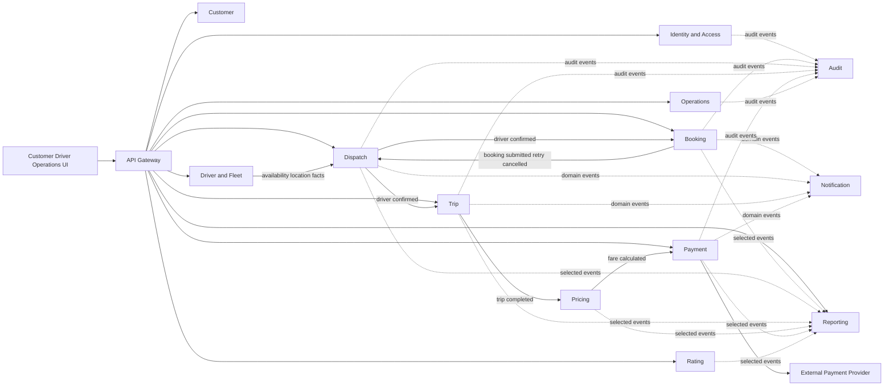
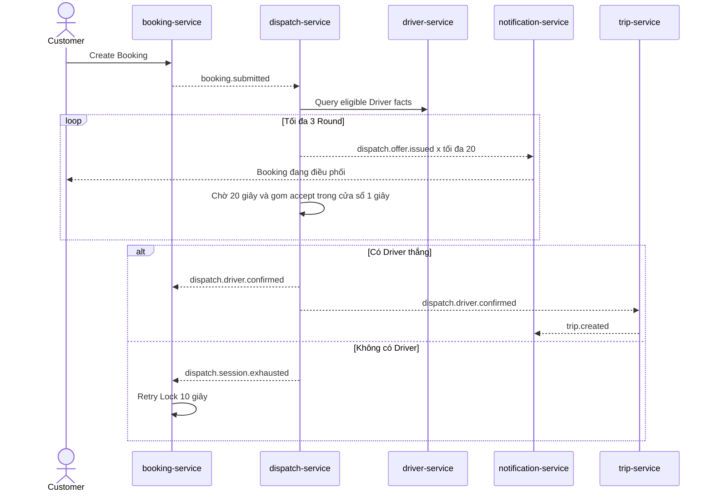
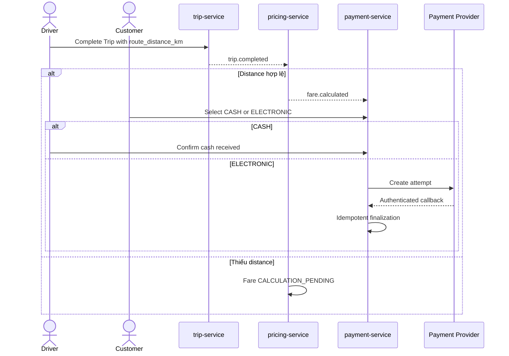
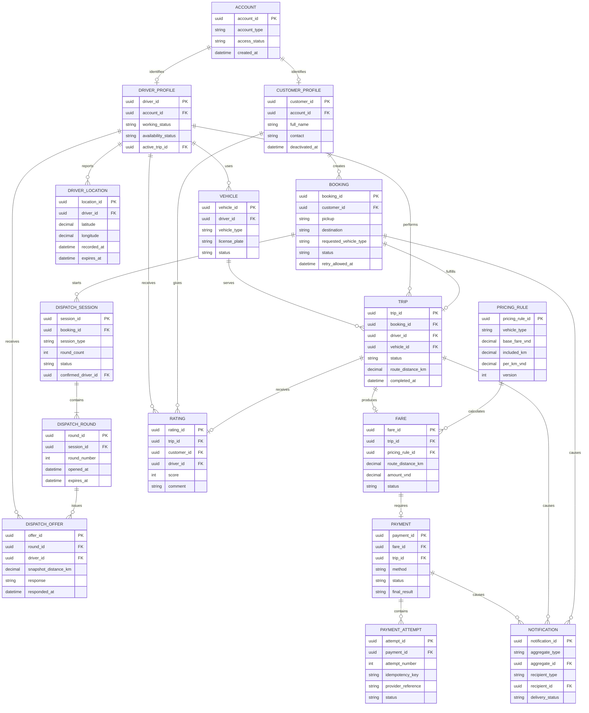

# Thiết kế kiến trúc Microservice CAB System

Tài liệu thiết kế kỹ thuật dựa trên `srs.md` v1.6

| Thuộc tính | Giá trị |
| --- | --- |
| Phiên bản | 2.0 |
| Baseline nghiệp vụ | SRS CAB System v1.6 |
| Phạm vi | MVP CAB trong 7 tuần |
| Trạng thái | Dự thảo kiến trúc để review |
| Đối tượng đọc | Product Owner, Business Analyst, Architect, Development, QA, Operations |

## 0. Nhật ký tài liệu

| Phiên bản | Ngày | Nội dung |
| --- | --- | --- |
| 1.0 | 28/09/2026 | Xác định service và event ban đầu. |
| 1.1 | 29/09/2026 | Bổ sung ánh xạ Use Case theo miền nghiệp vụ. |
| 2.0 | 01/10/2026 | Thiết kế lại bounded context, context map, ownership dữ liệu và ERD; đồng bộ MVP Design Decision MD-01 đến MD-07. |

## 1. Mục đích phạm vi và nguyên tắc

Tài liệu xác định ranh giới miền nghiệp vụ, service, ownership dữ liệu, hợp đồng giao tiếp, event và mô hình dữ liệu logic cho CAB System. SRS là nguồn nghiệp vụ có thẩm quyền. Kiến trúc không biến một quyết định kỹ thuật thành Customer Requirement.

Các nội dung trong SRS được sử dụng theo ba lớp:

1. **Source-derived:** nhu cầu được trích từ `Customer-Requirement.pdf`.
2. **Confirmed Decision:** quyết định nghiệp vụ đã thống nhất trong quá trình review.
3. **MVP Design Decision:** chi tiết Customer chưa quy định nhưng BA được phép xác định để triển khai/demo MVP, gồm MD-01 đến MD-07.

Nguyên tắc kiến trúc:

- Mỗi bounded context có ngôn ngữ, aggregate và quyền ghi dữ liệu riêng.
- Mỗi service sở hữu database/schema logic của mình; không join hoặc ghi trực tiếp database service khác.
- Tham chiếu xuyên service chỉ là ID nghiệp vụ, được đồng bộ qua API hoặc event.
- API đồng bộ dùng cho command/query cần phản hồi ngay; event dùng để phát tán thay đổi đã lưu bền vững.
- Event consumer phải idempotent; command có thể gửi lại phải có `idempotency_key`.
- Lỗi Payment, Notification, Reporting hoặc Audit không làm dừng luồng Booking/Trip đã ghi bền vững.
- Operations Staff không gán Driver thủ công. `dispatch-service` là owner duy nhất của quyết định điều phối.

## 2. Phân tách Use Case theo miền nghiệp vụ

| Bounded Context | Use Case / yêu cầu | Năng lực nghiệp vụ | Service thực hiện |
| --- | --- | --- | --- |
| Identity and Access | UC-01, UC-02; xác thực của UC-03; FR-56, FR-57 | Account, đăng nhập, access policy | `auth-service` |
| Customer | UC-15; FR-01 đến FR-03, FR-43 | Hồ sơ Customer | `customer-service` |
| Driver and Fleet | UC-03, UC-04, UC-16 đến UC-18; FR-04 đến FR-10, FR-44, FR-45, FR-48 | Driver, Vehicle, Availability, Location | `driver-service`, `vehicle-service` |
| Booking | Phần yêu cầu/hủy/thử lại của UC-05, UC-07; FR-11, FR-12, FR-19, FR-20, FR-60 | Booking và retry lock | `booking-service` |
| Dispatch | UC-05, UC-06; FR-13 đến FR-19, FR-21, FR-59 | Session, Round, Offer, chọn Driver | `dispatch-service` |
| Trip | UC-07, UC-08, UC-10; FR-22 đến FR-27, FR-41 | Trip, milestone và lịch sử Trip | `trip-service` |
| Pricing | Phần tính cước của UC-09; FR-28, FR-29 | Bảng giá và Fare | `pricing-service` |
| Payment | Phần thanh toán của UC-09; FR-30 đến FR-34, FR-39, FR-50 | Payment và Payment Attempt | `payment-service` |
| Rating | UC-11; FR-42 | Rating sau Trip | `rating-service` |
| Notification | FR-15, FR-33, FR-35 đến FR-40 | Notification và Delivery | `notification-service` |
| Operations | UC-12, UC-13; FR-43 đến FR-50 | Giám sát và hỗ trợ theo quyền | `operations-service` |
| Reporting | UC-14; FR-51 đến FR-55 | Read model báo cáo | `reporting-service` |
| Audit | FR-58 | Audit trail | `audit-service` |

Một Use Case có thể đi qua nhiều context, nhưng mỗi trạng thái chỉ có một owner. Ví dụ UC-05 đi qua Booking, Dispatch và Notification; chỉ Dispatch được xác nhận Driver, còn Booking chỉ phản ánh kết quả.

## 3. Ubiquitous Language

| Thuật ngữ | Định nghĩa | Context sở hữu |
| --- | --- | --- |
| Booking | Yêu cầu đặt xe gồm pickup, destination và vehicle type trước khi có Trip. | Booking |
| Retry Lock | Khoảng 10 giây sau Session thất bại trước khi Customer được retry cùng Booking. | Booking |
| Dispatch Session | Một lần điều phối tự động kiểu PRIMARY, RETRY hoặc RECOVERY. | Dispatch |
| Dispatch Round | Một đợt trong Session; tối đa 20 Driver được mời đồng thời trong 20 giây. | Dispatch |
| Candidate Snapshot | Ảnh chụp Driver hợp lệ và khoảng cách tới pickup tại thời điểm tạo Round. | Dispatch |
| Dispatch Offer | Đề nghị dành cho đúng một Driver trong một Round. | Dispatch |
| Confirmed Driver | Driver thắng theo BRULE-11, không phải Driver được Operations chọn. | Dispatch |
| Trip | Chuyến được hình thành sau khi Dispatch xác nhận Driver. | Trip |
| Route Distance | Quãng đường Trip dùng cho công thức cước MVP. | Trip |
| Pricing Rule | Bảng cấu hình giá theo vehicle type của MD-01. | Pricing |
| Fare | Số tiền Pricing tính sau Trip completed. | Pricing |
| Payment Attempt | Một lần gửi thanh toán điện tử, tối đa ba Attempt/Trip theo MD-07. | Payment |
| Recovery Session | Tối đa một Session khi Driver đã xác nhận không thể phục vụ trước `PICKED_UP`. | Dispatch |

## 4. Bounded Context

### 4.1. Danh mục bounded context

| Context | Aggregate Root | Dữ liệu owner | Không sở hữu |
| --- | --- | --- | --- |
| Identity and Access | Account | Credential metadata, role/access state | Customer/Driver profile |
| Customer | Customer Profile | Thông tin cá nhân Customer | Booking, Trip, Payment |
| Driver and Fleet | Driver, Vehicle | Driver Profile, Availability, Location, Vehicle | Offer, Trip |
| Booking | Booking | Booking snapshot, status, Retry Lock | Session/Round/Offer |
| Dispatch | Dispatch Session | Session, Round, Candidate Snapshot, Offer | Booking input, Driver Profile, Trip |
| Trip | Trip | Trip, milestone, route distance | Fare, Payment |
| Pricing | Fare, Pricing Rule | Bảng giá versioned, Fare | Trip lifecycle, Payment result |
| Payment | Payment | Payment, Payment Attempt, provider reference | Fare calculation, card/account sensitive data |
| Rating | Rating | Rating | Trip lifecycle |
| Notification | Notification | Notification, Delivery | Trạng thái nghiệp vụ nguồn |
| Operations | Operational Case | Case và Support Action | Customer/Driver/Trip/Payment nguồn |
| Reporting | Reporting View | Read model và report period | Dữ liệu ghi nguồn |
| Audit | Audit Entry | Audit trail bất biến | Credential, dữ liệu thanh toán nhạy cảm |

### 4.2. Context Map

```mermaid
flowchart LR
    UI[Customer Driver Operations UI] --> GW[API Gateway]
    GW --> IAM[Identity and Access]
    GW --> CUS[Customer]
    GW --> DRV[Driver and Fleet]
    GW --> BKG[Booking]
    GW --> DSP[Dispatch]
    GW --> TRP[Trip]
    GW --> PAY[Payment]
    GW --> RAT[Rating]
    GW --> OPS[Operations]
    GW --> REP[Reporting]

    BKG -- booking submitted retry cancelled --> DSP
    DRV -- availability location facts --> DSP
    DSP -- driver confirmed --> BKG
    DSP -- driver confirmed --> TRP
    TRP -- trip completed --> PRC[Pricing]
    PRC -- fare calculated --> PAY
    PAY --> EXT[External Payment Provider]

    BKG -. domain events .-> NTF[Notification]
    DSP -. domain events .-> NTF
    TRP -. domain events .-> NTF
    PAY -. domain events .-> NTF

    BKG -. selected events .-> REP
    DSP -. selected events .-> REP
    TRP -. selected events .-> REP
    PRC -. selected events .-> REP
    PAY -. selected events .-> REP
    RAT -. selected events .-> REP

    IAM -. audit events .-> AUD[Audit]
    BKG -. audit events .-> AUD
    DSP -. audit events .-> AUD
    TRP -. audit events .-> AUD
    PAY -. audit events .-> AUD
    OPS -. audit events .-> AUD
```

Quan hệ nét liền là command/query hoặc integration trực tiếp cần kết quả. Quan hệ nét đứt là event bất đồng bộ. Reporting, Notification và Audit không được dùng làm nguồn trạng thái cho Booking, Dispatch, Trip hoặc Payment.

### 4.3. Ranh giới quan trọng

- Booking và Dispatch tách riêng: Booking sở hữu yêu cầu Customer; Dispatch sở hữu thuật toán và bằng chứng chọn Driver.
- Driver Location nằm trong Driver context cho MVP. Dispatch dùng projection/fact, không truy cập driver database.
- Pricing và Payment tách riêng: Pricing sở hữu công thức/bảng giá; Payment chỉ xử lý nghĩa vụ thanh toán của Fare đã công bố.
- Operations là facade cho nhân viên; thao tác thay đổi phải gửi command đến owner, không cập nhật database xuyên service.
- Reporting là read model; số liệu có thể trễ theo event nhưng không làm thay đổi giao dịch nguồn.

## 5. Aggregate và invariant

| Aggregate | Owner | Invariant |
| --- | --- | --- |
| Account | auth-service | Credential không xuất hiện trong event; quyền được kiểm tra tại gateway và service owner. |
| Driver | driver-service | Eligible khi available, không có active Trip và location age ≤60 giây. |
| Booking | booking-service | Retry dùng cùng Booking sau lock 10 giây; chỉ sửa trước retry; hủy trước `PICKED_UP`. |
| Dispatch Session | dispatch-service | Tối đa 3 Round; không mời lại Driver trong cùng Session; RECOVERY tối đa một lần. |
| Dispatch Round | dispatch-service | Tối đa 20 Driver; Candidate Snapshot cố định; Offer hết hạn sau 20 giây theo server. |
| Dispatch Offer | dispatch-service | Một phản hồi cuối/Offer; chỉ một Driver được confirmed/Session. |
| Trip | trip-service | Milestone theo thứ tự; command lặp không tạo chuyển trạng thái lặp; sau `PICKED_UP` không hủy trực tiếp. |
| Fare | pricing-service | Chỉ tính sau completed; dùng Pricing Rule version và route distance; thiếu distance thì `CALCULATION_PENDING`. |
| Payment | payment-service | Tối đa 3 Attempt điện tử/Trip; callback trùng/muộn không ghi kết quả cuối lần hai. |
| Rating | rating-service | Chỉ nhận sau Trip completed theo chính sách Rating được duyệt. |

## 6. Ánh xạ Context sang Microservice

| Service | Context | Database logic | API/command chính | Event chính |
| --- | --- | --- | --- | --- |
| `auth-service` | Identity and Access | auth-db | register, login, authorize | `account.registered`, `access.changed` |
| `customer-service` | Customer | customer-db | get/update profile | `customer.profile.updated` |
| `driver-service` | Driver and Fleet | driver-db | profile, availability, location | `driver.availability.updated`, `driver.location.updated` |
| `vehicle-service` | Driver and Fleet | vehicle-db | create/update vehicle | `vehicle.updated` |
| `booking-service` | Booking | booking-db | create, revise, retry, cancel | `booking.submitted`, `booking.retry.requested`, `booking.cancelled` |
| `dispatch-service` | Dispatch | dispatch-db | respond Offer, view Session | Session/Offer lifecycle, `dispatch.driver.confirmed`, `dispatch.session.exhausted` |
| `trip-service` | Trip | trip-db | milestone, cannot-serve, view history | Trip milestone, `trip.completed` |
| `pricing-service` | Pricing | pricing-db | get Fare, manage rule config | `fare.calculated`, `fare.calculation.pending` |
| `payment-service` | Payment | payment-db | select method, cash confirm, electronic attempt/callback | `payment.finalized`, `payment.failed` |
| `rating-service` | Rating | rating-db | create/get Rating | `rating.created` |
| `notification-service` | Notification | notification-db | delivery query | `notification.delivered`, `notification.failed` |
| `operations-service` | Operations | operations-db | cases, support commands | `operations.action.recorded` |
| `reporting-service` | Reporting | reporting-db | report query | Consumer của selected events |
| `audit-service` | Audit | audit-db | audit query theo quyền | Consumer của auditable events |

## 7. Luồng liên service

### 7.1. Booking và điều phối

```mermaid
sequenceDiagram
    actor C as Customer
    participant B as booking-service
    participant D as dispatch-service
    participant R as driver-service
    participant N as notification-service
    participant T as trip-service

    C->>B: Create Booking
    B-->>D: booking.submitted
    D->>R: Query eligible Driver facts
    loop Tối đa 3 Round
        D-->>N: dispatch.offer.issued x tối đa 20
        N-->>C: Booking đang điều phối
        D->>D: Chờ 20 giây và gom accept trong cửa sổ 1 giây
    end
    alt Có Driver thắng
        D-->>B: dispatch.driver.confirmed
        D-->>T: dispatch.driver.confirmed
        T-->>N: trip.created
    else Không có Driver
        D-->>B: dispatch.session.exhausted
        B->>B: Retry Lock 10 giây
    end
```

Dispatch chọn Driver bằng Candidate Snapshot: khoảng cách nhỏ hơn thắng; nếu bằng nhau thì phản hồi CAB System nhận trước thắng. DB lock/version chỉ bảo vệ ghi đồng thời, không thay quy tắc nghiệp vụ này.

### 7.2. Trip cước và thanh toán

```mermaid
sequenceDiagram
    actor D as Driver
    actor C as Customer
    participant T as trip-service
    participant P as pricing-service
    participant M as payment-service
    participant X as Payment Provider

    D->>T: Complete Trip with route_distance_km
    T-->>P: trip.completed
    alt Distance hợp lệ
        P-->>M: fare.calculated
        C->>M: Select CASH or ELECTRONIC
        alt CASH
            D->>M: Confirm cash received
        else ELECTRONIC
            M->>X: Create attempt
            X-->>M: Authenticated callback
            M->>M: Idempotent finalization
        end
    else Thiếu distance
        P->>P: Fare CALCULATION_PENDING
    end
```

Trip completed không bị đảo ngược khi Pricing/Payment lỗi. Pricing hoặc Payment retry độc lập. Payment Attempt thứ tư bị từ chối theo MD-07.

## 8. Domain Event

Event envelope tối thiểu:

| Trường | Ý nghĩa |
| --- | --- |
| `event_id` | ID duy nhất để consumer khử trùng lặp |
| `event_type`, `schema_version` | Loại và phiên bản hợp đồng |
| `occurred_at` | Thời điểm producer ghi nhận |
| `producer` | Service phát |
| `aggregate_id`, `aggregate_version` | Aggregate và version nguồn |
| `correlation_id`, `causation_id` | Truy vết chuỗi xử lý |
| `payload` | Dữ liệu tối thiểu, không có credential/payment sensitive data |

| Event | Producer | Consumer chính | Trace |
| --- | --- | --- | --- |
| `booking.submitted` | booking | dispatch, notification, audit | FR-12, FR-35 |
| `booking.retry.requested` | booking | dispatch, audit | FR-19, MD-03 |
| `booking.cancelled` | booking/trip owner theo trạng thái | dispatch, notification, reporting, audit | FR-60, MD-04 |
| `driver.availability.updated` | driver | dispatch | FR-08, FR-09 |
| `driver.location.updated` | driver | dispatch, trip | FR-10, MD-02, MD-05 |
| `dispatch.offer.issued/responded/expired` | dispatch | notification, audit | FR-15 đến FR-18 |
| `dispatch.driver.confirmed` | dispatch | booking, trip, notification, reporting, audit | FR-16, FR-21 |
| `dispatch.session.exhausted` | dispatch | booking, notification, reporting, audit | FR-19 |
| `trip.driver-cannot-serve` | trip | dispatch, notification, audit | FR-59 |
| `trip.arrived-at-pickup/customer-picked-up/in-progress/completed` | trip | notification, pricing, reporting, audit | FR-24 đến FR-27 |
| `fare.calculated` | pricing | payment, notification, reporting, audit | FR-28, MD-01 |
| `fare.calculation.pending` | pricing | operations, notification, audit | MD-01 |
| `payment.finalized/failed` | payment | notification, reporting, audit | FR-32 đến FR-34, MD-07 |
| `rating.created` | rating | reporting, audit | FR-42 |

## 9. ERD logic theo bounded context

ERD dưới đây là mô hình liên kết nghiệp vụ toàn hệ thống. Bảng ownership ở §9.2 xác định context của từng entity. Ký hiệu `FK` trong ERD có nghĩa là tham chiếu logic; với quan hệ xuyên service, đó không phải foreign key vật lý và không cho phép join database xuyên service.

### 9.1. Sơ đồ ERD

```mermaid
erDiagram
    ACCOUNT ||--o| CUSTOMER_PROFILE : identifies
    ACCOUNT ||--o| DRIVER_PROFILE : identifies
    DRIVER_PROFILE ||--o{ VEHICLE : uses
    DRIVER_PROFILE ||--o{ DRIVER_LOCATION : reports

    CUSTOMER_PROFILE ||--o{ BOOKING : creates
    BOOKING ||--o{ DISPATCH_SESSION : starts
    DISPATCH_SESSION ||--|{ DISPATCH_ROUND : contains
    DISPATCH_ROUND ||--o{ DISPATCH_OFFER : issues
    DRIVER_PROFILE ||--o{ DISPATCH_OFFER : receives

    BOOKING ||--o| TRIP : fulfills
    DRIVER_PROFILE ||--o{ TRIP : performs
    VEHICLE ||--o{ TRIP : serves

    PRICING_RULE ||--o{ FARE : calculates
    TRIP ||--o| FARE : produces
    FARE ||--o| PAYMENT : requires
    PAYMENT ||--o{ PAYMENT_ATTEMPT : contains

    TRIP ||--o| RATING : receives
    CUSTOMER_PROFILE ||--o{ RATING : gives
    DRIVER_PROFILE ||--o{ RATING : receives

    BOOKING ||--o{ NOTIFICATION : causes
    TRIP ||--o{ NOTIFICATION : causes
    PAYMENT ||--o{ NOTIFICATION : causes

    ACCOUNT {
        uuid account_id PK
        string account_type
        string access_status
        datetime created_at
    }
    CUSTOMER_PROFILE {
        uuid customer_id PK
        uuid account_id FK
        string full_name
        string contact
        datetime deactivated_at
    }
    DRIVER_PROFILE {
        uuid driver_id PK
        uuid account_id FK
        string working_status
        string availability_status
        uuid active_trip_id FK
    }
    VEHICLE {
        uuid vehicle_id PK
        uuid driver_id FK
        string vehicle_type
        string license_plate
        string status
    }
    DRIVER_LOCATION {
        uuid location_id PK
        uuid driver_id FK
        decimal latitude
        decimal longitude
        datetime recorded_at
        datetime expires_at
    }
    BOOKING {
        uuid booking_id PK
        uuid customer_id FK
        string pickup
        string destination
        string requested_vehicle_type
        string status
        datetime retry_allowed_at
    }
    DISPATCH_SESSION {
        uuid session_id PK
        uuid booking_id FK
        string session_type
        int round_count
        string status
        uuid confirmed_driver_id FK
    }
    DISPATCH_ROUND {
        uuid round_id PK
        uuid session_id FK
        int round_number
        datetime opened_at
        datetime expires_at
    }
    DISPATCH_OFFER {
        uuid offer_id PK
        uuid round_id FK
        uuid driver_id FK
        decimal snapshot_distance_km
        string response
        datetime responded_at
    }
    TRIP {
        uuid trip_id PK
        uuid booking_id FK
        uuid driver_id FK
        uuid vehicle_id FK
        string status
        decimal route_distance_km
        datetime completed_at
    }
    PRICING_RULE {
        uuid pricing_rule_id PK
        string vehicle_type
        decimal base_fare_vnd
        decimal included_km
        decimal per_km_vnd
        int version
    }
    FARE {
        uuid fare_id PK
        uuid trip_id FK
        uuid pricing_rule_id FK
        decimal route_distance_km
        decimal amount_vnd
        string status
    }
    PAYMENT {
        uuid payment_id PK
        uuid fare_id FK
        uuid trip_id FK
        string method
        string status
        string final_result
    }
    PAYMENT_ATTEMPT {
        uuid attempt_id PK
        uuid payment_id FK
        int attempt_number
        string idempotency_key
        string provider_reference
        string status
    }
    RATING {
        uuid rating_id PK
        uuid trip_id FK
        uuid customer_id FK
        uuid driver_id FK
        int score
        string comment
    }
    NOTIFICATION {
        uuid notification_id PK
        string aggregate_type
        uuid aggregate_id FK
        string recipient_type
        uuid recipient_id FK
        string delivery_status
    }
```

### 9.2. Ownership của entity trong ERD

| Entity | Owner service | Quan hệ xuyên service được phép |
| --- | --- | --- |
| ACCOUNT | auth-service | Account ID trong profile |
| CUSTOMER_PROFILE | customer-service | Customer ID trong Booking/Rating |
| DRIVER_PROFILE, DRIVER_LOCATION | driver-service | Driver facts/projection cho Dispatch và Trip |
| VEHICLE | vehicle-service | Vehicle ID/type cho Booking/Trip/Pricing |
| BOOKING | booking-service | Booking ID/snapshot cho Dispatch và Trip |
| DISPATCH_SESSION, DISPATCH_ROUND, DISPATCH_OFFER | dispatch-service | Event kết quả cho Booking/Trip |
| TRIP | trip-service | Event completed/distance cho Pricing; Trip ID cho Rating/Payment |
| PRICING_RULE, FARE | pricing-service | Fare ID/amount cho Payment |
| PAYMENT, PAYMENT_ATTEMPT | payment-service | Event kết quả cho Notification/Reporting/Audit |
| RATING | rating-service | Event cho Reporting/Audit |
| NOTIFICATION | notification-service | Chỉ tham chiếu aggregate/recipient ID |

Audit Entry, Operational Case và Reporting View không nối vào ERD giao dịch bằng foreign key. Chúng lưu `target_type`, `target_id`, `correlation_id` hoặc projection riêng để giữ ranh giới context.

## 10. Quy tắc dữ liệu MVP

| Chủ đề | Quy tắc |
| --- | --- |
| Cước | Pricing Rule versioned theo MD-01; Fare lưu version và input để tái hiện phép tính. |
| Driver snapshot | Round lưu khoảng cách snapshot; location mới không làm thay đổi thứ tự của Round đang mở. |
| Hủy | Hủy hợp lệ trước `PICKED_UP` không tạo Fare/Payment; nếu Fare chưa final thì chuyển trạng thái không thu phí theo MD-04. |
| Mất kết nối | State server là nguồn đúng; command idempotent; Offer timeout theo server — MD-05. |
| Retention | Từng owner chạy retention job theo MD-06; event/report projection không được giữ lâu hơn dữ liệu nguồn nếu không có căn cứ riêng. |
| Payment retry | Tối đa ba Attempt, mỗi Attempt có key/reference riêng — MD-07. |

## 11. Bảo mật nhất quán và khả năng phục hồi

| Chủ đề | Thiết kế |
| --- | --- |
| Authentication | Gateway xác minh token; service owner kiểm tra role và quyền trên object. |
| Payment data | Chỉ lưu provider reference/token không nhạy cảm; callback phải xác thực và idempotent. |
| Event consistency | Transactional outbox hoặc cơ chế tương đương; consumer inbox/dedup theo `event_id`. |
| Concurrency | Aggregate version/optimistic lock; Dispatch dùng atomic confirmation nhưng áp dụng tie-break nghiệp vụ trước khi commit. |
| Failure isolation | Circuit breaker/timeout cho provider; queue cho Notification/Reporting/Audit; lỗi consumer không rollback aggregate nguồn. |
| Observability | Correlation ID xuyên Gateway, command, event và provider callback; metric riêng cho Session/Round/Offer/Payment Attempt. |
| Retention | Job xóa/ẩn danh có audit kết quả, hỗ trợ legal/incident hold ở mức MVP theo MD-06. |

## 12. Truy vết SRS và quyết định MVP

| Nhóm | Service/thiết kế thực hiện |
| --- | --- |
| MD-01 Fare | trip-service cung cấp distance; pricing-service version bảng giá/Fare; payment-service nhận Fare đã tính. |
| MD-02 Driver priority | driver-service cung cấp fact; dispatch-service tạo Candidate Snapshot và sort theo distance. |
| MD-03 Response | dispatch-service quản lý 3 Round × 20 Driver × 20 giây và cửa sổ 1 giây. |
| MD-04 Cancellation | booking-service/trip-service kiểm tra mốc; pricing/payment không tạo nghĩa vụ thu phí. |
| MD-05 Disconnect | Gateway và service owner xử lý idempotency; Dispatch dùng server expiry; Driver location freshness 60 giây. |
| MD-06 Retention | Mỗi service xóa/ẩn danh dữ liệu owner theo nhóm; audit-service ghi kết quả job. |
| MD-07 Payment retry | payment-service giới hạn ba Attempt và xử lý callback trùng/muộn. |
| FR-01 đến FR-60 | Ánh xạ Use Case/context tại §2 và service tại §6. |

## 13. Điểm còn mở không cản trở cấu trúc MVP

Các vấn đề phụ thuộc tổ chức hoặc nhà cung cấp vẫn được giữ là Open Issue trong SRS: permission matrix chi tiết, danh tính/hợp đồng Payment Provider, nhà cung cấp/kênh Notification, ngưỡng chất lượng định lượng, thủ tục nghiệm thu và nền tảng giao diện. MVP có thể dùng adapter/simulator, nhưng không được ghi tên nhà cung cấp hoặc cam kết chất lượng chưa được xác nhận.

Mọi thay đổi chính sách ABC sau MVP phải thay cấu hình/rule trong context owner và phát phiên bản event/API tương thích; không chuyển ownership dữ liệu giữa service nếu chưa có quyết định kiến trúc mới.
